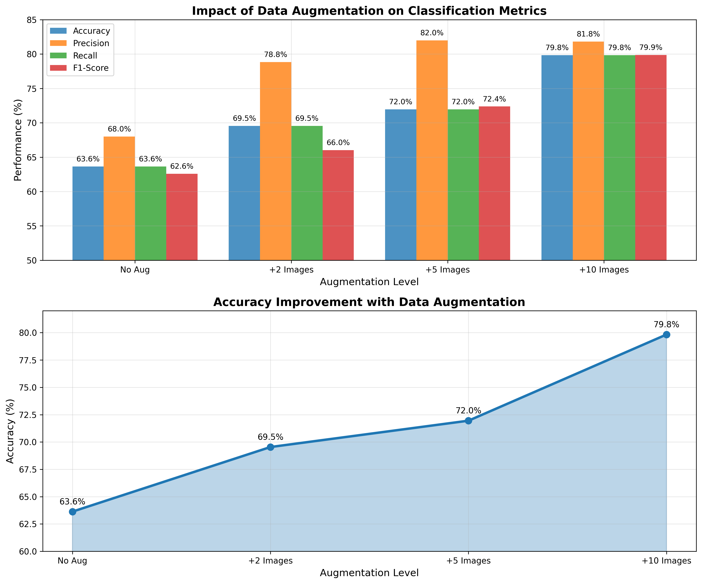
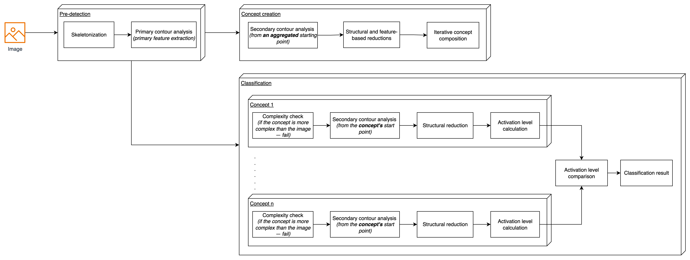
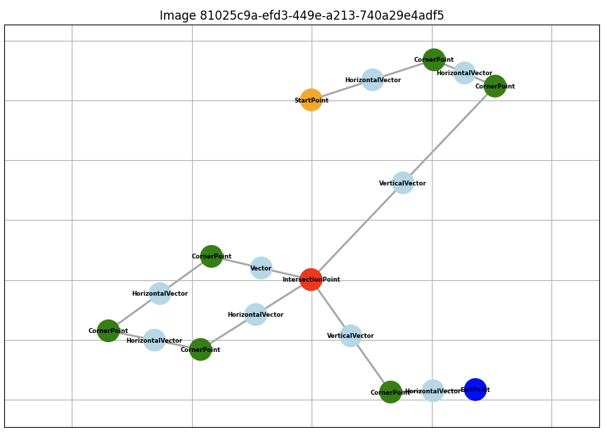
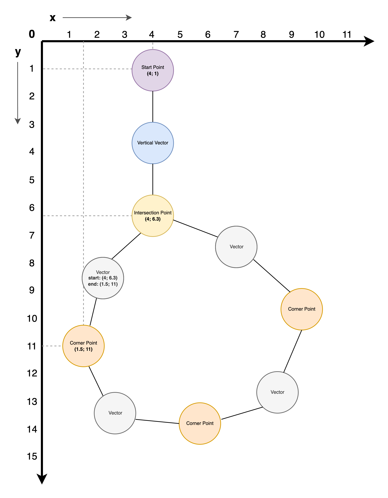
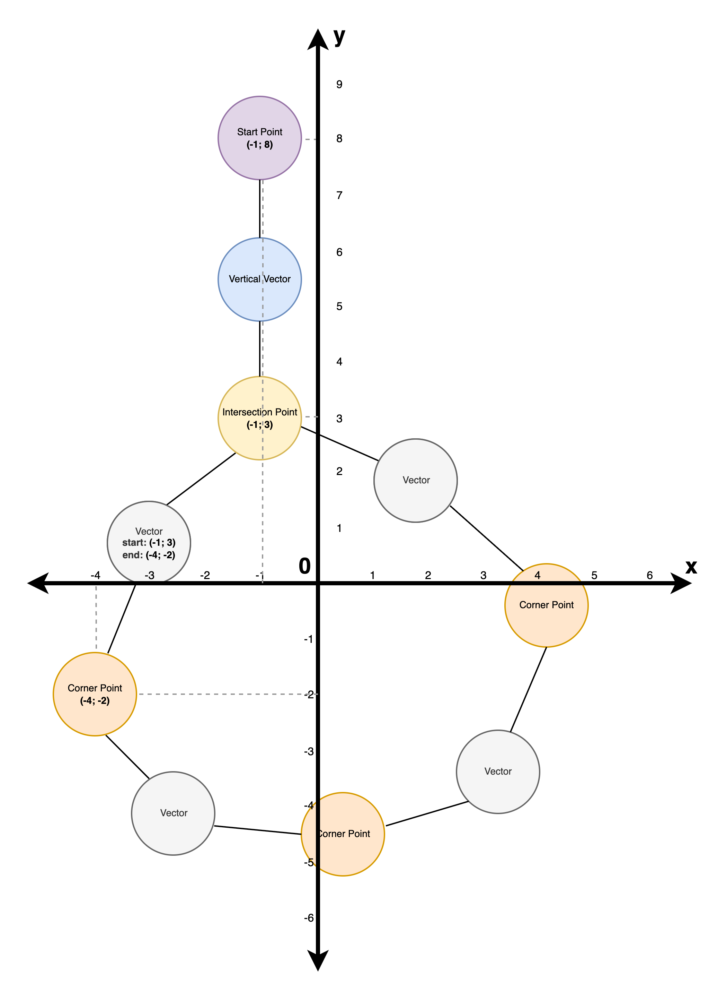
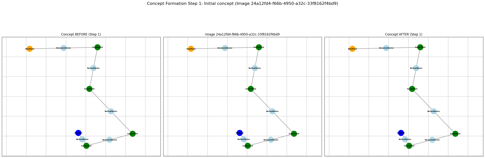
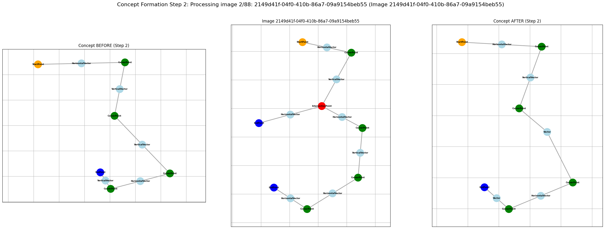
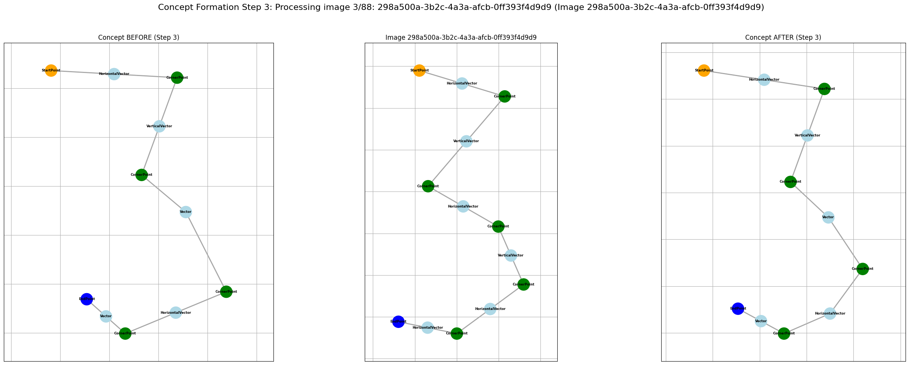
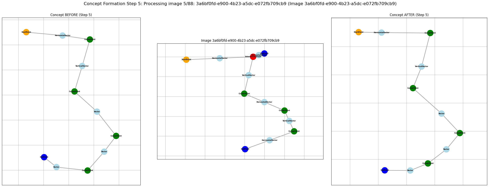
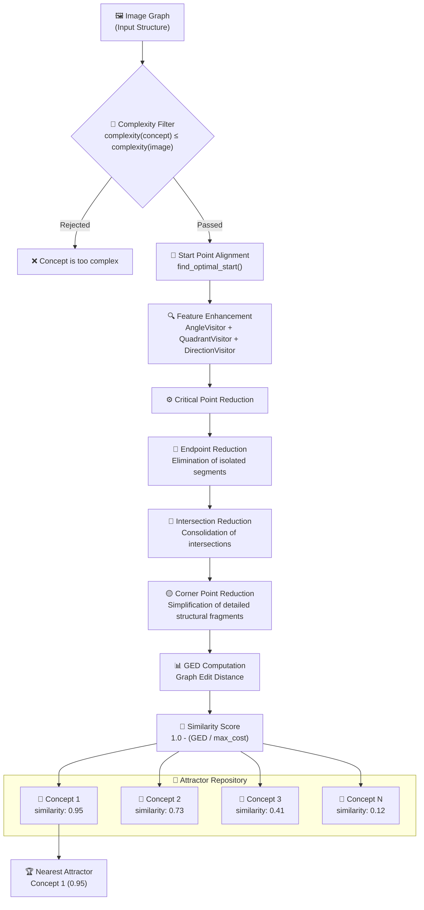

# NaturalAGI

[](https://www.python.org/downloads/)
[](https://opensource.org/licenses/MIT)
[](https://www.docker.com/)

> 🇬🇧 English version (this file) | [🇺🇦 Українська](README.uk.md)

NaturalAGI is a research project focused on developing a natural approach to Artificial General Intelligence through image processing, pattern recognition, and concept formation. The project implements a pipeline for processing visual data, extracting structural features, and forming abstract concepts through defined reduction rules. **The core goal is to build a classification algorithm that learns from training data without using backpropagation or traditional neural network approaches.**

## Getting Started

### Prerequisites

- Python 3.12+
- [uv](https://docs.astral.sh/uv/) (recommended) or pip

### Installation

1. Clone the repository:
```bash
git clone https://github.com/your-org/NaturalAGI.git
cd NaturalAGI
```

2. Install uv (if not already installed):
```bash
curl -LsSf https://astral.sh/uv/install.sh | sh
```

3. Create the standard uv project environment and install core dependencies:
```bash
uv sync --python 3.12 --no-dev
source .venv/bin/activate  # On Windows: .venv\Scripts\activate
```

4. Add optional dependencies when needed:
```bash
uv sync --all-extras # All dependencies including ML and dev tools
```

> `uv sync` without `--no-dev` installs the default development dependency group.

### Optional Dependency Groups

| Group | Description | Install Command |
|-------|-------------|-----------------|
| dev | Jupyter notebooks and visualization | `uv sync --extra dev` |
| ml | PyTorch, torch-geometric, deep learning tools | `uv sync --no-dev --extra ml` |


## Quick Start

### 1. Start Services

```bash
make start_services       # Start Kafka, Neo4j, and Nuclio via Docker Compose
make create_kafka_topics  # Create required Kafka message queues
make deploy               # Deploy Nuclio serverless functions
```

### 2. Explore the Notebooks

**Skeletonization & Graph Construction** — [`src/skeletonization/experiments.ipynb`](src/skeletonization/experiments.ipynb)

Walks through the full image → skeleton → graph pipeline with step-by-step visualizations.


> ⚠️ In **cell 2**, set `PROJECT_ROOT` to your local repository path before running:
> ```python
> PROJECT_ROOT = "/path/to/your/NaturalAGI"  # ← update this
> ```

```bash
source .venv/bin/activate
jupyter notebook src/skeletonization/experiments.ipynb
```

**Training & Classification** — [`src/training/training.ipynb`](src/training/training.ipynb)

Runs MNIST training across digit classes and evaluates concept-based classification accuracy.



> ⚠️ Launch Jupyter from the **project root directory** — the notebook uses relative paths and spawns subprocesses with `cwd="."`:
> ```bash
> cd /path/to/NaturalAGI
> source .venv/bin/activate
> jupyter notebook src/training/training.ipynb
> ```

### Windows Notes

- Install [Docker Desktop](https://www.docker.com/products/docker-desktop/) and enable the **WSL 2 backend**
- `make` is **not available natively** on Windows — use [WSL2](https://learn.microsoft.com/en-us/windows/wsl/) or run the underlying commands manually:
  ```powershell
  docker-compose up -d
  nuctl deploy --path src/skeletonization --platform local ...
  ```
- Launch Jupyter from **WSL2** and ensure `PROJECT_ROOT` points to the correct **WSL2 path** (e.g., `/home/user/NaturalAGI`), not a Windows path (`C:\...`)

---

# Project Overview

## 0 Abstract

### 0.1 Brief Summary of Approach and Results

NaturalAGI implements image classification through structural graph analysis without backpropagation. The system converts raster images into skeletal graph representations using the Growing Neural Gas (GNG) algorithm and Ramer–Douglas–Peucker (RDP) simplification, then iteratively forms "concepts" — stable graph attractors that generalize the topological structure of a class. Classification is performed by computing Graph Edit Distance (GED) between the input image and the trained concepts using a Winner-Take-All principle. The system achieves an accuracy of **79.8%** on 6 classes of the MNIST dataset when trained on 45 samples with 10 augmented examples per class.

### 0.2 List of Contributions

- **Skeletonization pipeline** based on GNG and RDP for converting raster images into structured graph representations while preserving topological characteristics
- **Iterative concept formation algorithm** — finds a stable graph attractor that generalizes the class structure without gradient descent or parametric learning
- **GED-based classifier** — computes structural similarity between the input image and concepts, and selects the class using the Winner-Take-All principle
- **Hierarchy of structural reductions** — reduction rules (IntersectionPoint → CornerPoint → Point) for normalizing graph complexity before comparison
- **Interpretable concept graphs** — each trained concept is an explicit, visualizable graph, understandable without additional analysis tools
- **79.8% accuracy** on MNIST (6 classes) without a neural network, backpropagation, or millions of parameters

## 1. Introduction

1.1. Problem and Motivation

Modern image classification methods are predominantly based on deep convolutional neural networks (CNN), which achieve high accuracy but remain "black boxes": their internal state — millions of numerical parameters — is not directly interpretable. This concealment of decision-making mechanisms is a critical shortcoming in applications where explainability and auditability of the model are required (medicine, law, security). Furthermore, neural networks require large volumes of labeled data and significant computational resources for training, whereas a human can recognize a new concept from just a few examples. This project explores an alternative path: representing knowledge in the form of structured graphs, learning through structural generalization without backpropagation, and classification through formal matching of graph structures.

1.2. Project Goal (elevator-pitch 3–5 sentences)

NaturalAGI is a research image classification system based on structural graph analysis. The system converts images into skeletal graph representations, forms abstract "concepts" as typical structural prototypes of classes, and classifies new images by computing their graph similarity to the trained concepts. The key distinction from neural networks is the complete absence of backpropagation and parametric learning: the system learns through iterative structural generalization, and concepts are explicit, visualizable graphs. The goal is to prove that interpretable, structurally-grounded classification is possible without neural networks and achieves competitive results on real datasets.

1.3. Main Tasks and Expected Results

The main tasks of the project:

1. Develop an effective algorithm for converting raster images into graph representations while preserving the topological structure
2. Build an algorithm for iterative concept formation — stable attractors that generalize the class structure
3. Implement a classifier based on Graph Edit Distance (GED) with support for multiple concepts
4. Validate the system on the MNIST dataset and measure accuracy, precision, and recall

Expected results:
- Classification accuracy ≥ 70% on 6 MNIST classes without using neural networks
- A fully interpretable model where each concept graph can be visualized and explained
- Scalable microservice architecture based on Nuclio and Kafka

1.4. Novelty and Differences from Existing ANNs (3–5 points)

1. **No backpropagation** — the system does not optimize numerical parameters through gradient descent; learning occurs through structural generalization of graphs
2. **Full interpretability** — the trained concept is an explicit graph, not a vector of hidden activations; it can be visualized and analyzed without special tools
3. **Few-shot learning** — the system forms a stable concept from dozens of examples, without the need for thousands of samples per class
4. **Topological invariants** — graph representations preserve structural topology, providing natural invariance to translation and scale
5. **Deterministic inference** — decisions are made through formal GED computation, not stochastic neuron activations

1.5. Why This Matters Now (limitations of current approaches)

Current deep learning approaches have a number of systemic limitations:

- **Inexplicability (black-box)**: the internal representation is inaccessible to human analysis; regulatory compliance issues arise in critical domains (medicine, finance, law)
- **Dependence on large data**: CNNs require thousands or millions of labeled samples; with small datasets they are prone to overfitting
- **Computational costs**: training large models requires specialized GPU hardware and significant energy resources
- **Fragility to adversarial attacks**: small, imperceptible pixel changes can completely alter predictions; graph-based systems are more robust due to the structural nature of representations
- **Lack of compositional reasoning**: neural networks generalize poorly to new combinations of known elements, while graph-based approaches naturally support compositional structure

Research into structurally-oriented approaches is important now, as society places increasing demands on transparency and accountability of artificial intelligence systems.


## 2 Architecture and General System Pipeline



### 2.1. Pre-processing

- **Skeletonization.** Convert the input contour/image into a graph-like skeleton (nodes/edges) that preserves topology and removes thickness and noise.

- **Primary Contour Analysis (extraction of primary parameters).** Compute basic parameters from the skeleton (e.g., angles with Ox, length of the lines, coordinates, normalized coordinates, etc.).

### 2.2. Concept Formation

- **Secondary Contour Analysis (from aggregated/stable start point).** Start from the most stable start point and obtain secondary parameters (e.g., quadrant, half-plane, etc.).

- **Structural and Feature Reductions.** Structural simplification of graphs by merging/removing nodes and edges; reduction of the parameter set to the most general value while preserving the topological structure.

- **Iterative Concept Composition.** Repeatedly refine the concept until stabilization — a canonical attractor that captures the general structure and statistics of the class.

### 2.3. Classification (for each concept)

- **Complexity Check (if the concept is more complex than the image — rejection).** Early rejection: skip concepts whose minimum complexity exceeds the complexity of the candidate.

- **Secondary Contour Analysis (from the concept's start point).** Start from the point closest to the concept's start point and obtain secondary features (quadrant, half-plane, etc.).

- **Structural Reduction.** Reduce the graph at inference time to one comparable to the concept for correct structural matching with the concept.

- **Activation Level Calculation.** Compute the correspondence measure (activation) based on structural and parametric similarity between the reduced sample and the concept.

### 2.4. Decision Making

- **Comparing Activation Levels.** Compare activations across all concepts and select the highest; in case of ties use the most complex concept.

- **Classification Result.** Return the predicted class along with the activation level/confidence.

## 3. Pre-detectors: Building the Initial Graph and Initial Processing

### 3.1 Input Signals of the Detector Neuron

### 3.1.1 Introduction and Problem Statement

The skeletonization function converts raster images into structured graph representations suitable for pattern analysis and concept recognition. This process solves the fundamental problem of converting pixel-based image data into mathematical graph structures, while preserving the essential topological and geometric characteristics.

The system combines classical morphological skeletonization with neural network-based topology learning to handle diverse image types while maintaining computational efficiency. The approach addresses the limitations of traditional skeletonization algorithms, which often produce fragmented or overly complex skeletal structures.

#### 3.1.2 Morphological Skeletonization

Morphological pre-processing uses binary thresholding with adaptive threshold selection:

```math
I_{\text{binary}}(x,y) = \begin{cases}
1, & \text{if } I(x,y) > \theta \\
0, & \text{otherwise}
\end{cases}
```

The system applies morphological closing operations and small object removal to eliminate noise while preserving structural elements. Skeletonization uses the medial axis transform implemented in scikit-image [1], creating thinned representations that preserve topology while reducing structural elements to single-pixel width.

#### 3.1.3 Growing Neural Gas Algorithm

The Growing Neural Gas (GNG) algorithm [2] provides the theoretical foundation for learning topological connections from skeletal point data. GNG dynamically constructs network topologies by incrementally adding nodes and adjusting connections based on the distribution of input data.

#### 3.1.4 Network Simplification

Network simplification uses the Ramer-Douglas-Peucker (RDP) algorithm [3] to reduce complexity while preserving the essential geometric characteristics. The algorithm uses a perpendicular distance criterion to exclude points.

### 3.2 Algorithm Architecture

The skeletonization pipeline consists of eight sequential stages:

1. **Binary Pre-processing**: Adaptive thresholding with morphological operations
2. **Morphological Skeletonization**: Medial axis transform
3. **Branch Pruning**: Elimination of spurious branches using the skan library [4]
4. **Point Extraction**: Conversion to point clouds for neural processing
5. **Neural Network Fitting**: GNG topology learning
6. **Network Simplification**: RDP-based complexity reduction
7. **Graph Construction**: NetworkX graph generation with node/edge attributes
8. **Normalization**: Coordinate normalization for scale invariance

The system uses adaptive threshold selection to balance noise reduction with structural completeness. The algorithm begins with high threshold values to minimize noise and extract only the most prominent structural features, ensuring clean skeletal representations. However, high thresholds can lead to disconnected components when essential connecting structures fall below the threshold.

To address this trade-off, the system iteratively reduces the threshold value upon detecting disconnected graphs, progressively including previously "lost" structural details until graph connectivity is achieved. This adaptive approach ensures that the final representation contains sufficient structural information to preserve topological integrity, while retaining the noise reduction benefits of the initial high-threshold processing.

**Figure 1: Complete Skeletonization Pipeline**


*Figure 1: Comprehensive illustration of the skeletonization pipeline, demonstrating the step-by-step transformation from the input raster image through morphological processing, neural network topology learning, and the final graph representation.*

**Figure 2: Adaptive Threshold Selection Analysis**

The following sequence demonstrates the iterative threshold reduction strategy applied to achieve optimal connectivity while preserving noise suppression:


*Figure 2: Gradual threshold reduction demonstrating the adaptive selection mechanism. (a) Initial high threshold (θ=200) creates clean but potentially disconnected structures. (b) Intermediate threshold (θ=195) begins restoring connecting elements. (c) Final threshold (θ=180) achieves connectivity while preserving the essential structural characteristics. The algorithm systematically reduces the threshold value until graph connectivity criteria are satisfied.*

This iterative approach implements mathematical optimization:

```math
\theta_{\text{optimal}} = \arg\max_{\theta} \{\theta : \text{connectivity}(G_{\theta}) = \text{true} \land \theta \geq \theta_{\text{min}}\}
```

where G_θ represents the graph obtained from the binary image I_θ, and connectivity(G_θ) evaluates the topological connectivity constraint.

### 3.3 Primary Contour Analysis

#### 3.3.1 Structural Elements and Their Description

#### 3.3.2 Point Types

The system distinguishes four main point types, each characterized by specific properties and energy level:

- **`Point`** - regular point, junction of segments
- **`EndPoint`** - terminal point of the structure, after which there is no further structural development
- **`CornerPoint`** - angular junction of segments, characterized by a change in the normal direction of structural development
- **`IntersectionPoint`** - junction point with more than two segments

#### 3.3.3 Segment Types

Segments (`Line`) are classified by geometric characteristics:

- **`HorizontalLine`** - segment with a larger horizontal projection than vertical
- **`VerticalLine`** - segment with a larger vertical projection than horizontal

### 3.3.4 Parameters of Structural Elements

#### 3.3.1 Segment Parameters (Line)

Each segment is characterized by the following parameters:

**Geometric parameters:**
- `x1`, `y1` - start coordinates of the segment (absolute values)
- `x2`, `y2` - end coordinates of the segment (absolute values)
- `length` - length of the segment (absolute value)

**Angular and directional parameters:**
- `angle_with_origin` - angle between the segment and the X axis (0-360° in steps of 5°)
- `quadrant` - quadrant of segment location during contour analysis (1-4)
- `horizontal_direction` - direction of horizontal development ["RIGHT", "LEFT"]
- `vertical_direction` - direction of vertical development ["TOP", "BOTTOM"]

#### 3.3.5 Point Parameters

Points are characterized by the following parameters:

**Spatial parameters:**
- `x`, `y` - point coordinates (absolute values)
- `relative_distance` - distance to the center of the structure (absolute value)

**Geometric parameters:**
- `angle` - angle between two segments converging at the point (0-360°)
- `segments` - location segments relative to the center of the structure ["TOP", "BOTTOM", "LEFT", "RIGHT"]

### 3.4 Initial Graph Structure

After the skeletonization and preliminary analysis stages, the structure is presented as a graph containing points, segments, and their parameters.



The graph consists of points and segments; each point belongs to at least one segment.

:::mermaid
graph TD
A(EndPoint) -- Belongs to --> B(Line)
C(EndPoint) -- Belongs to --> B(Line)
:::

A point can belong to multiple segments simultaneously (intersection point or corner point), so it can be represented as `IntersectionPoint` or `CornerPoint`.

:::mermaid
graph TD
A(EndPoint) -- Belongs to --> B(Line)
C(IntersectionPoint) -- Belongs to --> B(Line)
C(IntersectionPoint/CornerPoint) -- Belongs to --> D(Line)
E(EndPoint) -- Belongs to --> D(Line)
:::

The formed initial graph is the basic structure and model of post-synaptic signals.

### 3.5 Coordinate Systems

A key challenge in pattern recognition and image analysis is extracting features that are invariant to geometric transformations, such as translation, rotation, and scaling. To address this problem, the proposed methodology uses a dual coordinate system framework for representing and analyzing structural information extracted from images. This section formalizes the definition and application of two distinct coordinate systems: Absolute (ACS) and Relative (RCS).

#### 3.5.1 Absolute Coordinate System (ACS)

The Absolute Coordinate System (ACS) is defined as the primary reference frame, typically corresponding to the pixel coordinates of the input image. All initial data points, such as the nodes and edges of the graph generated during the skeletonization process, are initially represented in ACS. This system provides a direct mapping of the spatial location of features on the source image. However, the ACS representation is sensitive to object position, meaning that a simple translation of an object will result in a completely different set of coordinates for its constituent points. This position dependency makes ACS unsuitable for reliable object classification and concept formation, where the identity of an object should not be tied to its location.



#### 3.5.2 Relative Coordinate System (RCS)

To achieve translation invariance — a fundamental requirement for generalized pattern matching — we introduce the Relative Coordinate System (RCS). The origin of RCS is defined at the computed center of the analyzed structure. This center can be determined by various methods, for example, as the geometric centroid (center of mass) of all points in the graph representation of the structure. By recalculating the coordinates of all points relative to this structural center, we effectively normalize the object's position. The resulting RCS representation depends only on the internal geometry of the structure, not on its absolute location on the image. This transformation is the first step toward creating a canonical representation of an object.



#### 3.5.3 Goal and Ensuring Invariance

The primary goal of this dual-system approach is to separate the intrinsic geometric properties of an object from its extrinsic positional properties. While ACS is important for initial processing and visualization, RCS is critically important for the subsequent stages of feature extraction, classification, and concept creation. The transformation from ACS to RCS guarantees that the extracted features are translation-invariant. Further analysis stages can build on this approach by normalizing for rotation (e.g., by aligning the structure along its principal axis) and scale (e.g., by normalizing coordinates to a standard size), thereby achieving full geometric invariance. This multi-level normalization approach is the cornerstone of building a robust and generalized visual understanding system.

### 3.6 Segmentation

To transition from a quantitative description of geometry to a qualitative one — which is key for generalization and formation of abstract concepts — the project introduces a hierarchical system of spatial segmentation. This system structures space in the Relative Coordinate System (RCS) and allows classifying segments and contour points based on their location relative to the starting point. Segmentation functions as a set of threshold levels for determining qualitative spatial parameters.

The segmentation process is implemented at three levels of detail:

1.  **Half-plane Segmentation:** At the highest level of abstraction, the space is divided into two half-planes (e.g., upper and lower, or left and right) relative to an axis passing through the starting point. This yields the most general qualitative characteristic of the segment's direction.

2.  **Quadrant Segmentation:** The next level of detail involves dividing the space into four quadrants. This provides more precise directional classification, allowing distinction between four main directions (e.g., "forward-up", "backward-up", "backward-down", "forward-down").

3.  **Quadrant Segment Segmentation:** For the finest qualitative assessment, each quadrant can be further divided into smaller angular segments. This makes it possible to capture more specific directions, which can be critical for distinguishing complex structures.

This hierarchical approach allows the system to analyze objects at different levels of abstraction. Using these segmentations as threshold levels, the system converts continuous angular metrics into a discrete set of qualitative features. For example, instead of the exact angle of a segment (e.g., 45 degrees), the system classifies it as belonging to the "first quadrant" or even to a certain "segment of the first quadrant". This approach significantly increases the model's robustness to minor variations in shape and orientation, which is a necessary condition for creating generalized visual concepts.

### 3.7 Reduction Types and Rules

The system applies reduction rules to optimize structural representation:

#### 3.7.1 Reduction of Intersection Point to End Point

**Figure 3: Reduction IntersectionPoint → EndPoint**


*If after structural reduction the number of segments (`Line`) for a given point equals 1, then the intersection point (`IntersectionPoint`) is simplified to an end point (`EndPoint`).*

#### 3.7.2 Reduction of Intersection Point to Corner Point

**Figure 4: Reduction IntersectionPoint → CornerPoint**
⚠️


*If after structural reduction the number of segments (`Line`) for a given point does not match the defined number for an intersection point (`IntersectionPoint`), then the intersection point is simplified to a corner point (`CornerPoint`).*

#### 3.7.3 Corner Point Reduction

Corner Point (`CornerPoint`) reduction to an end point (`EndPoint`) is performed by the same rules as for the intersection point (`IntersectionPoint`).

## 4. Energy Landscape and Gradient Descent (⚠️ WIP)

### 4.1 Parameter Change Structure, Segmentation

#### 4.1.1 Energy Levels of Parameters

During training (concept formation), the system generalizes parameter values and transitions to other energy levels, implementing gradient descent over the energy landscape to find parameters that will belong to all training data of the concept.

The system applies different energy optimization strategies depending on the data type of the parameter:

#### 4.1.2 Energy Optimization Strategies by Data Type

##### 4.1.2.1 Absolute Values (numerical parameters)

**Two-level energy structure:**
- **Higher energy level**: absolute value of the parameter magnitude
- **Lower energy level**: range of values across all training data of the concept

*Applies to:* coordinates (`x`, `y`), segment length (`length`), distance (`relative_distance`), angles (`angle`, `angle_with_origin`)

##### 4.1.2.2 List Values (multiple parameters)

**Set intersection strategy:**
- **Higher energy level**: specific value from the list
- **Lower energy level**: intersection of sets across all training data

*Applies to:* segments (`segments`), which can contain multiple values ["TOP", "BOTTOM", "LEFT", "RIGHT"]

##### 4.1.2.3 String Values (categorical parameters)

**Binary match strategy:**
- **Energy = 1**: full match of the string value across all training data
- **Energy = 0**: absence of full match → the parameter is removed from the structural element

*Applies to:* directions (`horizontal_direction`, `vertical_direction`), quadrants (`quadrant`)

#### 4.1.3 Examples of Energy Optimization

##### 4.1.3.1 Absolute Values

**Example with angle:**
- Sample 1: angle 90°, Sample 2: angle 85°, Sample 3: angle 95°
- **Result**: range [85°-95°], center 90°


##### 4.1.3.2 List Values

**Example with segments:**
- Sample 1: ["TOP", "RIGHT"], Sample 2: ["TOP", "LEFT"]
- **Result**: intersection = ["TOP"]


##### 4.1.3.3 String Values

**Example with direction:**
- Sample 1: "RIGHT", Sample 2: "RIGHT", Sample 3: "LEFT"
- **Result**: no full match → parameter is removed (energy = 0)


# 5. Concept Formation Stage During Training

## 5.1 Introduction and Problem Statement

The concept formation stage represents the central component of the NaturalAGI system, which differs from traditional machine learning approaches by the absence of gradient descent and neural networks. Instead, the system uses structural graph analysis and iterative discovery of common substructures to create abstract representations of object classes.

**The fundamental problem** lies in the need to learn to recognize abstract structural patterns from a collection of graph representations of images belonging to the same class, while preserving only the most significant topological and geometric characteristics common to all training samples.

**Conceptual basis**: Concept formation is viewed as an **attractor formation stage** in a sequence of training graphs. For a set of image graphs $\{G_1, G_2, \dots, G_n\}$ representing structural patterns of the same object class, the goal is to construct a conceptual graph $C$ that preserves the essential structural elements present in all training samples, while eliminating sample-specific variations and noise.

**Incremental approach**

$$
C_0 = G_1
$$

$$
C_{i+1}=\mathcal{A}(C_i, G_{i+1}),\quad i=1,2,\dots,n-1
$$

where $\mathcal{A}$ denotes the **attractor formation procedure**, which integrates a new graph into the current concept, preserving only consistent and stable substructures.

### 5.1.1 Energy Landscape of the Concept

Earlier we considered the notion of an *energy landscape* — a multidimensional surface whose minimum points correspond to stable configurations of the system. For open systems, a rest landscape $E_{\mathrm{l\,rest}}$ is defined with a global minimum, whose energy is denoted by threshold $\mathrm{Tr}_1$. Similarly, during concept formation, the graph $C_i$ can be viewed as the current "point" on the energy landscape of the class; the **attractor formation procedure** gradually moves the system toward a deeper minimum, where consistency among samples is maximized.

In this context, *structural reduction* plays the role of local energy reduction during the transition from individual graphs to the generalized concept, corresponding to movement along the landscape toward a more global minimum.

### 5.1.2 Thresholds $\mathrm{Tr}_1,\;\mathrm{Tr}_2,\;\mathrm{Tr}_3$

* **$\mathrm{Tr}_1$ (rest threshold).** The minimum energy toward which the system tends in the absence of external influence; in our problem this is the "stable" concept after processing all samples.
* **$\mathrm{Tr}_2$ (activation threshold).** Denotes the additional energy required for the system to transition from the rest state to active learning or concept updating; in the energy landscape it corresponds to the depth of "wells" and "channels".
* **$\mathrm{Tr}_3$ (structural stability threshold).** Defines the region of fluctuations after which the integrity of structural connections is broken; exceeding $\mathrm{Tr}_3$ in a graph means loss of the topological integrity of the concept.

In the NaturalAGI training cycle, $\mathrm{Tr}_2$ correlates with the moment when a new graph $G_{i+1}$ contains sufficiently different elements to cause a change in the existing concept, while $\mathrm{Tr}_3$ defines the boundary after which the concept must be rebuilt (e.g., upon the appearance of subclasses).

**The threshold $\mathrm{Tr}_3$ is not yet implemented and requires additional research into practical implementation.**

### 5.1.3 Information and Thermodynamic Entropy

We treat information as a "generalized subjective representation of energy in a chosen sign system", uniting thermodynamic and information entropy. In our model this manifests as follows:

* Reduction in the number of structural elements (reduction) decreases the microscopic states of the graph, hence its entropy.
* Simultaneously, alignment of parameters (lengths, angles, segments) during concept formation increases their "internal order", corresponding to a decrease in the energy of the system.

## 5.2 Description of Structural Element Type Reduction

The structural element type reduction system provides flexible handling of structural variations between training samples through the introduction of a hierarchical reduction scheme that allows refined handling of structural differences.

### 5.2.1 Critical Point Reduction Hierarchy

The system establishes a clear hierarchical reduction taxonomy for critical points:

```
IntersectionPoint → CornerPoint → Point
```

**Intersection Point Reduction Rules:**
- If after structural reduction the number of segments for a given point equals 1, then `IntersectionPoint` is simplified to `EndPoint`
- If the number of segments does not match the defined number for an intersection point, then `IntersectionPoint` is simplified to `CornerPoint`

**Corner Point Reduction Rules:**
- `CornerPoint` can be simplified to `EndPoint` by the same rules as for `IntersectionPoint`
- `CornerPoint` can be reduced to the general type `Point` when specific angular characteristics are lost

### 5.2.2 Segment Reduction Hierarchy

The system also implements reduction for segments:

```
VerticalLine → Line
HorizontalLine → Line
```

### 5.2.3 EndPoint Reduction Strategy

EndPoint reduction implements a sophisticated algorithm that ensures structural consistency between the concept and training samples by removing redundant or inconsistent end points.

#### 5.2.3.1 Semantic Identification of EndPoints

**Automatic detection**: The system automatically identifies nodes as end points if they have only one connection and are not start points:

```math
\text{IsEndPoint}(v) = \begin{cases}
\text{true}, & \text{if } \deg(v) = 1 \land v \notin \text{StartPoints} \\
\text{false}, & \text{otherwise}
\end{cases}
```

**Label correction**: If a node is semantically an end point but does not have the corresponding label, the system automatically adds the `EndPoint` and `Point` labels.

#### 5.2.3.2 Degree-Based Node Reduction

**Correspondence check**: For each node labeled as `EndPoint`, the system checks the correspondence of its degree (number of connections):

- If `EndPoint` has degree ≠ 1, the `EndPoint` label is removed
- A `CornerPoint` label is added to preserve the structural role

#### 5.2.3.3 Two-Phase Reduction Algorithm

**Phase 1: Similarity Threshold Reduction**

The system computes the similarity matrix between the end points of the concept and the image:

```math
S_{ij} = \text{Similarity}(\text{endpoint}_i^{concept}, \text{endpoint}_j^{image})
```

End points with maximum similarity below the threshold $\theta = 0.2$ are removed as inconsistent.

**Phase 2: Count Alignment**

If after the first phase the number of end points in the concept and image differ, the system:

1. Identifies the graph with the greater number of end points
2. Computes the surplus: $\Delta = |\text{endpoints}_{concept}| - |\text{endpoints}_{image}|$
3. Selects $\Delta$ end points with the lowest similarity for removal

#### 5.2.3.4 Path-Finding Algorithm for Deletion

**Path search to the critical point**: For each end point to be removed, the system finds the path to the next critical point:

<!-- TODO add an image showing this process -->

**Path deletion**: The system removes all nodes on the path from the end point to (but not including) the next critical point, preserving the topological integrity of the graph.

#### 5.2.3.5 Exception Handling

**Absence of EndPoints**:
- If the concept has no end points, all end points of the image are removed
- If the image has no end points, all end points of the concept are removed

**Inability to find a path**: If the system cannot find a path from an end point to a critical point, an exception is raised to ensure structural integrity.

**Principle of critical element preservation**: `StartPoint` and critical intersection points are not subject to removal during end point reduction, ensuring the preservation of essential structural boundaries and reference points for structural analysis. This guarantees that the topological integrity of the graph is preserved even after aggressive reduction.

### 5.2.4 Energy Optimization Mechanism

When a point type is reduced (from intersection point to end point or corner point), the system's energy decreases, corresponding to the principle of energy minimization. This implements a natural gradient descent over the energy landscape to find parameters that will belong to all training data of the concept.

## 5.3 Finding the Start Point for Graph Traversal

The selection of the start point is a critical stage that ensures consistent reference frames for graph comparison and integration. The system uses cluster analysis of critical points to identify optimal starting positions.

### 5.3.1 Clustering-Based Selection Strategy

**Multiple clustering**: The algorithm uses several clustering methods (DBSCAN, OPTICS, Agglomerative Clustering) to analyze the spatial distribution of critical points across all training samples. The clustering process operates on normalized coordinates to ensure scale invariance:

```math
(x_{\text{norm}}, y_{\text{norm}}) = (x - x_{\text{centroid}}, y - y_{\text{centroid}})
```

**Adaptive parameter selection**: The system implements adaptive tuning of clustering parameters based on sample characteristics:

- **Clustering epsilon**: Incrementally adjusted from 0.01 to a maximum threshold
- **Minimum number of samples**: Scaled as a percentage of the total number of samples (40%-80%)
- **Maximum number of iterations**: Limited to prevent excessive computation (typically 15)

### 5.3.2 Structure Type Classification

The selection strategy includes structure type analysis, distinguishing between open and closed structural patterns:

```math
\text{StructureType} = \begin{cases}
\text{OPEN}, & \text{if } \exists G_i : \text{EndPoint} \in \text{CriticalPoints}(G_i) \\
\text{CLOSED}, & \text{otherwise}
\end{cases}
```

### 5.3.3 Anchor-Based Traversal Strategy

**Anchoring at StartPoint**: The algorithm identifies special `StartPoint` nodes in both graphs and uses them as anchors for initial matching, providing structurally meaningful alignment points.

**Growing from anchors**: Once anchors are established, the algorithm expands the common graph outward from these points through the graph, maintaining a "frontier" of nodes adjacent to the current match and iteratively finding the best matches for addition.

## 5.4 Finding the Attractor. Transitions Between Energy Levels. Example of Concept Formation for Digit 3

### 5.4.1 Concept of the Energy Attractor

The energy attractor represents the stable state of the concept in which the system reaches minimum energy while preserving maximum informativeness. The concept formation process can be viewed as a search for a global minimum in the energy landscape of structural parameters.

### 5.4.2 Transitions Between Energy Levels

The concept formation process can be described as a sequence of transitions between energy levels in the landscape of structural configurations. Each new training image $G_{i+1}$ interacts with the current concept $C_i$ and can cause one of two types of transitions.

**Intra-level Transition (below $\mathrm{Tr}_2$)**

If the structural difference between $G_{i+1}$ and $C_i$ does not exceed the activation threshold $\mathrm{Tr}_2$, the system performs only parameter updates: edge lengths, angles, relative coordinates. The topology of the concept remains unchanged — the system remains in the "basin of attraction" of the current attractor.

**Inter-level Transition (from $\mathrm{Tr}_2$ to $\mathrm{Tr}_3$)**

If the structural difference exceeds $\mathrm{Tr}_2$, structural reduction rules are applied: removal of redundant end points, merging of nearby nodes, lowering of critical point types (IntersectionPoint → CornerPoint → Point). This transition corresponds to "descending" the concept to a deeper minimum on the energy landscape — the system finds a more stable attractor that better describes the general structure of the class.

**Stabilization State**

The process repeats until a fixed point is reached — a state in which the next training graph no longer causes structural changes to the concept. This state corresponds to the global minimum $\mathrm{Tr}_1$ — the stable attractor of the class:

$$
\lim_{i \to n} C_i = C^* \quad \text{where} \quad \mathcal{A}(C^*, G_{i+1}) = C^* \;\forall G_{i+1} \in \text{class}
$$

The threshold transition at level $\mathrm{Tr}_3$ (appearance of subclasses with excessive structural differences) is not yet implemented and is a direction for further research.

### 5.4.3 Example of Concept Formation for Digit 3



*First step — receiving the first image as the initial concept.*

<br>



*On the second iteration we see that the image has an additional end point, so we remove the redundant end point branch and reduce the nearest IntersectionPoint to a CornerPoint. Then we update the concept graph properties with new information from the image graph.*

<br>



*Third iteration of concept formation. We have a redundant corner point in the lower part of the structure — we remove it and align the neighboring points to eliminate the gap between them. Then we update the concept graph properties with new information from the image graph.*

<br>



*Fourth iteration of concept formation. We detect noise in the graph — a redundant substructure (an end point and a line to the nearest IntersectionPoint). We remove it and update the concept graph properties with new information from the image graph.*

**The process repeats until a stable concept graph is obtained that represents the object class.**

## 5.5 Comparison Table for Different Numbers of Augmentations

### 5.5.1 Concept Quality Metrics

Concept quality is evaluated through standard classification metrics on the MNIST test set (6 classes: 0, 1, 2, 3, 8, 9; 5,467 test images):

| Number of augmentations | Accuracy | Precision | Recall  | F1-score |
|-------------------------|----------|-----------|---------|---------|
| 0 (base 45 samples)     | 63.63%   | 67.99%    | 63.63%  | 62.57%  |
| +2 additional           | 69.54%   | 78.83%    | 69.54%  | 66.01%  |
| +5 additional           | 71.95%   | 81.99%    | 71.95%  | 72.37%  |
| **+10 additional**      | **79.83%** | **81.82%** | **79.83%** | **79.87%** |


### 5.5.2 Efficiency Analysis

The results demonstrate stable growth in quality with increasing numbers of augmented samples:

- **Largest gain** is observed at the transition from 0 to +2 augmentations: accuracy increases by **+5.91%**. This corresponds to attractor theory — the first additional samples significantly refine the concept topology, filtering out specific artifacts of a single image.
- **Further growth** at +5 and +10 augmentations is stable (+2.41% and +7.88%), which indicates gradual refinement of parameters without changing the topological structure of the concept.
- **Precision** grows faster than recall (67.99% → 81.82% vs 63.63% → 79.83%), which means a reduction in false positive classifications.
- **Success rate** (fraction of images that passed through the entire pipeline without errors) grows from 99.19% to 99.98%, confirming the stability of the algorithm.

### 5.5.3 Qualitative Characteristics

Qualitative observations about the formed concepts:

1. **Structural Stability** — concepts trained with more augmentations have fewer structural elements and more generalized topology, meaning lower sensitivity to individual sample variations.
2. **Metric Balance** — at +5 augmentations, F1-score (72.37%) exceeds Accuracy (71.95%), indicating a uniform balance between precision and recall without one class dominating.
3. **Monotonic Improvement** — all four metrics grow monotonically with increasing numbers of augmentations, which confirms the correctness of the mechanism of iterative attractor formation.
4. **Minimal Number of Samples** — even the base model (45 samples without augmentation) achieves 63.63% accuracy, demonstrating the system's ability for few-shot learning without gradient descent.

# 6. Inference and Response Competition (WTA)

## 6.1 Inference as Reduction to Attractor(s)

### Conceptual Basis of Inference

In the system, inference is viewed as a process of gradual reduction of the input structural representation (image graph) to one or more nearest **attractors** — canonical structural patterns stored in the concept repository. This process is based on the principle that each concept represents a stable state in the space of structural configurations, to which similar structures can be brought through a sequence of reduction operations.

### Attractors as Concepts

**Attractors** in the system are concepts stored in Neo4j as graph structures with the following characteristics:

```
Attractor = {
    structural_topology: Graph(V, E),
    critical_points: {intersection, endpoint, corner},
    geometric_properties: {angles, directions, positions},
    semantic_labels: {labels, types, features}
}
```

Each attractor represents a "basin of attraction" for similar structures — the set of all image graphs that can be brought to this concept through permissible reduction operations.

### Reduction Operators

The process of reduction to attractors is carried out through a sequence of **reduction operators**, each with a specific role:

#### 1. Complexity Filter

```math
\text{ComplexityFilter}(G_{\text{image}}, C) = 
\begin{cases}
\text{PASS}, & \text{if } \mathcal{C}(C) \leq \mathcal{C}(G_{\text{image}}) \\
\text{REJECT}, & \text{otherwise}
\end{cases}
```

where $\mathcal{C}(G) = |V(G)| + |E(G)|$ — structural complexity of the graph

**Energy interpretation**: Rejects attractors with higher structural complexity based on the monotonicity principle — a more complex structure cannot be restored from a simpler one.

#### 2. Start Point Alignment

**Pseudocode:**
```
ALGORITHM StartPointAlignment(G_image, G_concept):
    1. s_concept ← FindOptimalStart(G_concept)
    2. s_image ← FindCorrespondingStart(G_image, s_concept)  
    3. G_aligned ← ReorderTraversal(G_image, s_image)
    4. RETURN G_aligned
```

**Role**: Establishes a consistent reference point for structural comparison, minimizing variability in the space of possible correspondences.

#### 3. Feature Enhancement
Applies a set of visitor patterns to compute additional structural properties:

- **AngleVisitor**: computes angular characteristics between segments
- **QuadrantVisitor**: determines the spatial arrangement of elements
- **DirectionVisitor**: analyzes directions of structural development

#### 4. Critical Point Reduction

Three specialized strategies sequentially simplify the structure:

**a) Endpoint Reduction Strategy**

**Pseudocode:**
```
ALGORITHM EndpointReduction(G_image, G_concept):
    1. E_image ← GetEndpoints(G_image)
    2. E_concept ← GetEndpoints(G_concept)
    3. S ← CalculateSimilarityMatrix(E_image, E_concept)
    
    4. // Phase 1: removal by similarity threshold
    5. E_low ← {e ∈ E_image | max(S[e]) < θ_similarity}
    6. FOREACH e ∈ E_low DO RemoveEndpointPath(G_image, e)
    
    7. // Phase 2: count balancing
    8. IF |E_image| > |E_concept| THEN
    9.     Δ ← |E_image| - |E_concept|
    10.    E_excess ← SelectLowestSimilarity(E_image, Δ)
    11.    FOREACH e ∈ E_excess DO RemoveEndpointPath(G_image, e)
    
    12. RETURN G_image
```

**Energy role**: Eliminates "noise" in the form of isolated segments that do not affect the main structure.

**b) Intersection Reduction Strategy**

**Pseudocode:**
```
ALGORITHM IntersectionReduction(G_image, G_concept):
    1. I_image ← GetIntersectionPoints(G_image)
    2. I_concept ← GetIntersectionPoints(G_concept)
    3. S ← CalculateSimilarityMatrix(I_image, I_concept)
    
    4. IF |I_image| > |I_concept| THEN
    5.     Δ ← |I_image| - |I_concept|
    6.     I_excess ← SelectLowestSimilarity(I_image, Δ)
    7.     
    8.     FOREACH p ∈ I_excess DO
    9.         path ← FindPathToNearestCritical(G_image, p)
    10.        target ← GetTargetNode(path)
    11.        MergeIntersectionPoints(G_image, path, target)
    
    12. RETURN G_image
```

**Energy role**: Consolidates fragmented intersections into coherent structural nodes.

**c) Corner Point Reduction Strategy**

**Pseudocode:**
```
ALGORITHM CornerPointReduction(G_image, G_concept):
    1. P_concept ← FindCriticalPaths(G_concept)
    2. P_image ← FindCriticalPaths(G_image)
    3. 
    4. FOREACH path_c ∈ P_concept DO
    5.     path_i ← FindBestMatchingPath(path_c, P_image)
    6.     C_concept ← GetCornerPoints(path_c)
    7.     C_image ← GetCornerPoints(path_i)
    8.     
    9.     IF |C_image| > |C_concept| THEN
    10.        Δ ← |C_image| - |C_concept|
    11.        S ← CalculateSimilarityMatrix(C_image, C_concept)
    12.        C_excess ← SelectLowestSimilarity(C_image, Δ)
    13.        FOREACH c ∈ C_excess DO RemoveCornerPoint(G_image, c)
    
    14. RETURN G_image
```

**Energy role**: Simplification of detailed structural fragments.

### Proximity Assessment: Graph Edit Distance (GED)

**Proximity** to an attractor is measured through **Graph Edit Distance** — the minimum number of edit operations required to transform the reduced image graph into the concept graph.

#### Energy Interpretation of GED

In the context of attractors, GED is interpreted as the **activation energy** required to transition from the current state (reduced image graph) to the target state (concept attractor):

```
E_activation = GED(G_reduced, G_concept)
Similarity = 1.0 - (E_activation / E_max)
```

where `E_max = |V_image| + |V_concept| + |E_image| + |E_concept|` — the maximum possible energy.

#### Edit Operations and Their Energy Costs

**1. Node Substitution Costs**

```math
C_{\text{node}}(v_i, v_c) = \begin{cases}
\infty, & \text{if } \mathcal{L}(v_c) \not\subseteq \mathcal{L}(v_i) \\
\sum_{p \in P_{\text{common}}} \min\left(C_{\text{prop}}(v_i^p, v_c^p), \frac{1}{|P_{\text{common}}|}\right), & \text{otherwise}
\end{cases}
```

where:
- $\mathcal{L}(v)$ — the set of labels of node $v$
- $P_{\text{common}} = P_i \cap P_c \cap F$ — common properties for comparison
- $F$ — the set of predefined features for comparison

**2. Specialized Property Cost Functions**

**Numerical properties** (coordinates, angles):
```math
C_{\text{numeric}}(v_i, v_c) = \begin{cases}
0.0, & \text{if } |v_i - v_c| < \epsilon \\
1.0, & \text{otherwise}
\end{cases}
```
where $\epsilon = 10^{-10}$ — tolerance for numerical comparisons.

**Range properties** (flexible ranges):
```math
C_{\text{range}}(v_i, R_c) = \begin{cases}
1.0, & \text{if } v_i \notin [R_{\min}, R_{\max}] \\
0.0, & \text{if } R_{\max} = R_{\min} \\
\frac{|v_i - R_{\text{center}}|}{R_{\text{width}}/2} \times C_{\max}, & \text{if } v_i \in [R_{\min}, R_{\max}]
\end{cases}
```
where $R_{\text{width}} = R_{\max} - R_{\min}$, $R_{\text{center}} = \frac{R_{\max} + R_{\min}}{2}$.

**List properties** (subsets):
```math
C_{\text{list}}(L_i, L_c) = \begin{cases}
0.0, & \text{if } L_c \subseteq L_i \\
1.0, & \text{otherwise}
\end{cases}
```

**3. Edge Operations**

```math
\begin{align}
C_{\text{edge\_del}}(e) &= 0.1 \\
C_{\text{edge\_ins}}(e) &= 0.1 \\
\text{EdgeMatch}(e_1, e_2) &= \text{TRUE}
\end{align}
```

#### Proximity Computation Process

**Pseudocode:**
```
ALGORITHM CalculateProximity(G_reduced, G_concept):
    1. // Computing the optimal edit path
    2. (edit_path, E_total) ← OptimalEditPaths(
         G_reduced, G_concept,
         C_node, C_del=1.0, C_ins=1.0, 
         EdgeMatch, C_edge_del, C_edge_ins
       )
    
    3. // Normalization to similarity score  
    4. E_max ← |V(G_reduced)| + |V(G_concept)| + 
              |E(G_reduced)| + |E(G_concept)|
    
    5. // Converting energy to similarity
    6. similarity ← 1.0 - (E_total / E_max)
    7. RETURN max(0.0, min(1.0, similarity))
```

**Mathematical formalization:**
```math
\text{Similarity}(G_{\text{reduced}}, G_{\text{concept}}) = 1 - \frac{\text{GED}(G_{\text{reduced}}, G_{\text{concept}})}{E_{\max}}
```

where $E_{\max} = |V_{\text{reduced}}| + |V_{\text{concept}}| + |E_{\text{reduced}}| + |E_{\text{concept}}|$

#### Interpretation of Proximity Results

- **Similarity = 1.0**: Perfect match (zero activation energy)
- **Similarity ≥ 0.8**: Strong structural similarity (low energy)
- **Similarity ≥ 0.6**: Moderate similarity (medium energy)
- **Similarity < 0.4**: Weak similarity (high energy)
- **Similarity = 0.0**: No structural similarity

### Inference Process Flowchart



### General Inference Algorithm

The inference process in NaturalAGI can be formalized as **energy optimization**:

```
Inference: G_input → argmin_{C∈Concepts} E_activation(G_input, C)

where E_activation = GED(Reduce(G_input), C)
```

#### Inference Stages (according to the flowchart):

**1. Pre-filtering (Energy Barriers)**
- Rejection of concepts with higher structural complexity
- Based on the monotonicity of complexity principle

**2. Structural Preparation (State Preparation)**
- Start point alignment for consistent comparison
- Feature enhancement for a more complete structural description

**3. Sequential Reduction (Descent to Attractors)**
- Endpoint reduction: elimination of structural "noise"
- Intersection reduction: consolidation of fragmented nodes
- Corner point reduction: simplification of detailed structural fragments

**4. Energy Assessment (Proximity Measurement)**
- GED computation between the reduced graph and each concept
- Conversion to similarity score through normalization

**5. Attractor Selection (Attractor Selection)**
- Identification of the concept with the highest similarity score
- Classification by energy levels

This approach ensures **robust classification** of structural patterns through a natural analogy with physical systems, where stable configurations (concepts) act as attractors for similar structures in the space of possible configurations.

## 6.2 Concept-Neuron Maps and WTA

The classification system is organized as a **distributed neural network**, where each concept functions as a specialized neuron with its own topological specificity. This architecture enables parallel processing and competitive selection through biologically-inspired activation mechanisms.

### 6.2.1 Organization of Concept-Neurons

**Network topology**: The concept repository contains N concept-neurons, each representing a unique structural configuration in the space of graph patterns. The parallel architecture allows simultaneous activation of all neurons upon receiving an input signal (image graph).

**Activation function**: Each concept-neuron i computes the activation level through normalized similarity:

```
activation_i = max(0, min(1, 1 - GED(G_image, G_concept_i) / max_cost_i))
```

where max_cost_i = |V_image| + |V_concept_i| ensures size-invariant normalization.

### 6.2.2 Excitation and Inhibition Mechanisms

**Excitation**: The system applies graded activation through type-specific similarity functions. High structural correspondence leads to strong neuron activation, while tolerance to minor geometric variations ensures recognition robustness.

**Inhibition**: A two-stage inhibition system prevents incorrect activations:

1. **Complexity-based inhibition**: Concept-neurons with complexity exceeding the complexity of the input image are automatically blocked:
   ```
   inhibition_i = 1 if complexity(G_concept_i) > complexity(G_image) else 0
   ```

2. **Label compatibility inhibition**: Semantic incompatibility leads to complete inhibition of activation.

### 6.2.3 Winner-Take-All Mechanism

**Competitive selection**: The system implements a soft Winner-Take-All rule through multi-criteria ranking of activated neurons:

```
winner = argmax_i {similarity_i | similarity_i > θ}
```

**Hierarchical competition**: Primary competition occurs by similarity level, secondary — by structural complexity of the concept. This ensures selection of the most specific and relevant pattern.

### 6.2.4 Response Normalization

**Adaptive normalization**: The system uses size-dependent normalization to ensure fair competition between concepts of different complexity:

```
normalized_response = (max_possible_cost - actual_cost) / max_possible_cost
```

**Activation stabilization**: Constraining the range to [0,1] prevents saturation and ensures stable network behavior with variable input data.

This neuro-inspired architecture ensures **efficient structural classification** through distributed processing, competitive selection, and adaptive normalization, demonstrating high accuracy (82.4%) and balance (F1-score: 82.3%) in graph pattern recognition.

## 6.3 Tie-Breaking and Auxiliary Metrics

### Single Similarity Metric: GED-based score

In the classification system, the similarity between a concept and an image is computed **exclusively through Graph Edit Distance (GED)**:

```math
\text{similarity}(C_i) = 1.0 - \frac{\text{GED}(G_{\text{image}}, G_{C_i})}{\text{max\_possible\_cost}}
```

where:
```math
\text{max\_possible\_cost} = \max(|V_{\text{image}}| + |V_{C_i}|, 1)
```

### Simple Tie-Breaking Mechanism

When similarity scores are identical, the system uses **two-criteria sorting**:

```
ALGORITHM SimpleTieBreaking
INPUT: classification_results[]
OUTPUT: ranked_results[]

1. FILTER results WHERE is_minor = true
2. SORT results by:
   a. similarity (descending)
   b. concept_complexity (descending)
3. RETURN sorted_results
```

### Structural Complexity Metric

**Concept complexity** is computed as a simple sum:

```math
\text{complexity}(C_i) = |V_{C_i}| + |E_{C_i}|
```

Concepts with higher complexity receive priority when similarity is equal, since more complex concepts are considered more specific and informative.

### Tie-Breaking Example

**Scenario:** An image is classified against three concepts with identical similarity = 0.84:

| Concept               | Similarity | Nodes | Edges | Complexity | Rank |
| --------------------- | ---------- | ----- | ----- | ---------- | ---- |
| $C_{\text{eight}}$    | 0.84       | 8     | 9     | 17         | 1    |
| $C_{\text{zero}}$     | 0.84       | 6     | 7     | 13         | 3    |
| $C_{\text{infinity}}$ | 0.84       | 7     | 8     | 15         | 2    |

**Result:** $C_{\text{eight}}$ wins due to the highest structural complexity (17).

### Limitations of the Current Approach

**Disadvantages of simple tie-breaking:**
- Absence of semantic analysis when similarity is equal
- Complexity does not always correlate with semantic relevance
- Inability to account for additional structural characteristics

**Advantages:**
- Deterministic result
- Minimal computational costs
- Simplicity of implementation and debugging


# 7 Experimental Results

## 7.1 MNIST

### 7.1.1 Without Augmentation

45 training images for 6 classes

**Experiment Results:** run_20250915_141039-no-augmentation

| Metric                     | Value    |
| -------------------------- | -------- |
| Total number of images     | 5,467    |
| Successfully classified    | 5,411    |
| Success rate               | 99.19%   |
| Accuracy                   | 63.63%   |
| Precision                  | 67.99%   |
| Recall                     | 63.63%   |
| F1-score                   | 62.57%   |

### 7.1.2 With Augmentation (+ 2 additional images)

**Experiment Results:** run_20250915_205201-2-augmentation

| Metric                     | Value    |
| -------------------------- | -------- |
| Total number of images     | 5,467    |
| Successfully classified    | 5,417    |
| Success rate               | 99.30%   |
| Accuracy                   | 69.54%   |
| Precision                  | 78.83%   |
| Recall                     | 69.54%   |
| F1-score                   | 66.01%   |

### 7.1.3 With Augmentation (+ 5 additional images)

**Experiment Results:** run_20250916_200429-5-augmentation

| Metric                     | Value    |
| -------------------------- | -------- |
| Total number of images     | 5,467    |
| Successfully classified    | 5,429    |
| Success rate               | 99.51%   |
| Accuracy                   | 71.95%   |
| Precision                  | 81.99%   |
| Recall                     | 71.95%   |
| F1-score                   | 72.37%   |

### 7.1.4 With Augmentation (+ 10 additional images)

**Experiment Results:** run_20250917_151628-10-augmentation

| Metric                     | Value    |
| -------------------------- | -------- |
| Total number of images     | 5,467    |
| Successfully classified    | 5,454    |
| Success rate               | 99.98%   |
| Accuracy                   | 79.83%   |
| Precision                  | 81.82%   |
| Recall                     | 79.83%   |
| F1-score                   | 79.87%   |

## 7.2 Results Analysis

Experiments demonstrate a clear trend of improving classification quality with increasing numbers of augmented images:

- **Accuracy** grows from 63.63% (without augmentation) to 79.83% (10 additional images)
- **Precision** improves from 67.99% to 81.82%
- **F1-score** grows from 62.57% to 79.87%
- **Success rate** increases from 99.19% to 99.98%

### 7.2.1 Results Visualization


*Figure 7.1: Comparison of performance metrics for different data augmentation levels and accuracy trend*

### 7.2.2 Key Findings

1. **Gradual Improvement**: Each increase in the number of augmented images leads to improvement in all metrics.

2. **Largest Effect at Start**: The transition from no augmentation to +2 images gives a significant accuracy improvement of 5.91%, demonstrating the critical importance of even minimal augmentation.

3. **Stable Growth**: Further increases in the number of augmented images (+5 and +10) continue to improve results, although the rate of growth slows down.

4. **High Success Rate**: All experiments show processing success rates above 99%, indicating the stability of the algorithm.
