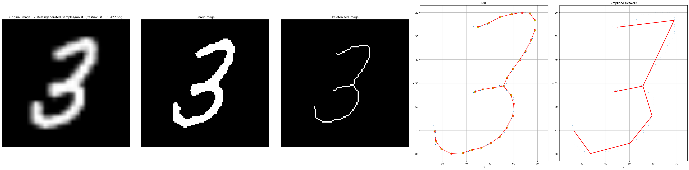
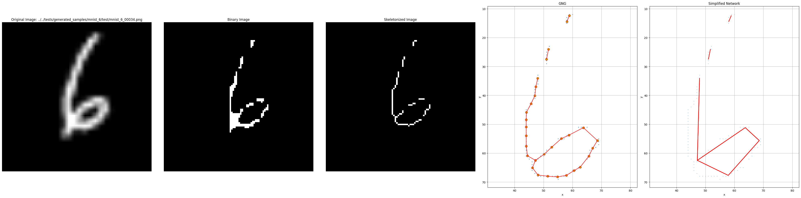
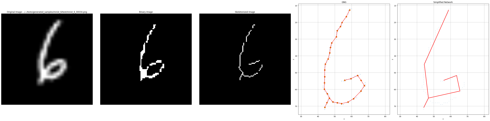
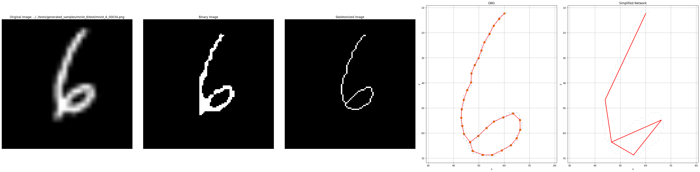
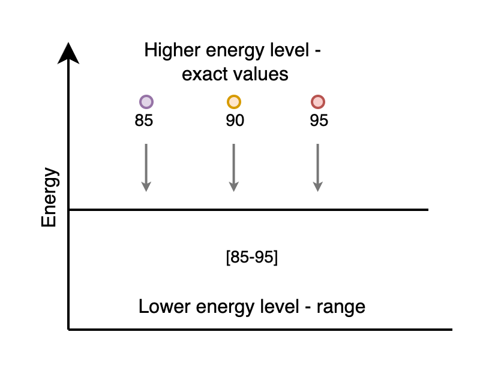
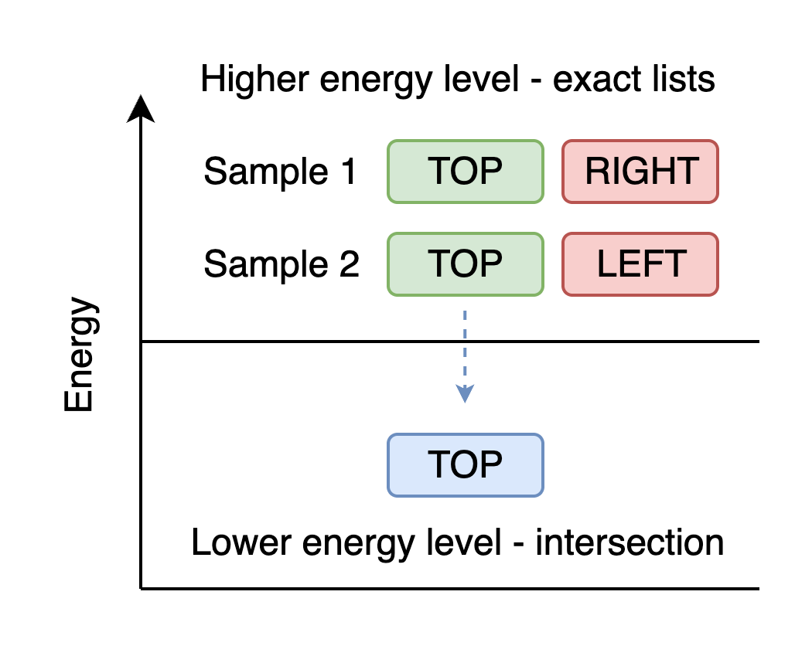
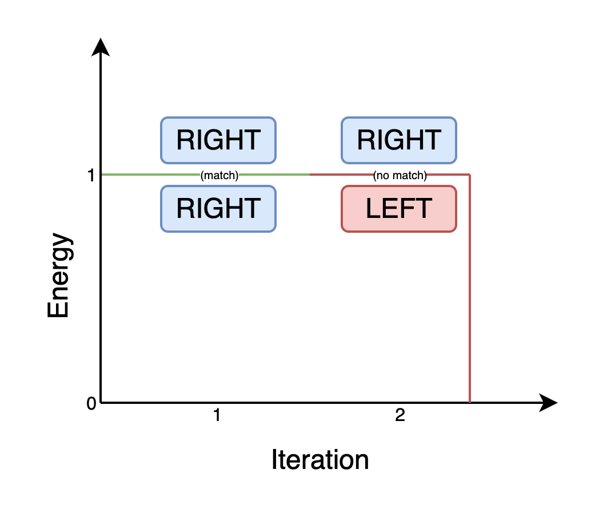

# NaturalAGI

NaturalAGI is a research project focused on developing a natural approach to Artificial General Intelligence through image processing, pattern recognition, and concept formation. The project implements a pipeline for processing visual data, extracting structural features, and forming abstract concepts through defined reduction rules. **The core goal is to build a classification algorithm that learns from training data without using backpropagation or traditional neural network approaches.**

# Project Overview

## 1. Попередня обробка зображень

### 1.1 Вступ та Постановка Проблеми

Функція скелетонізування перетворює растрові зображення у структуровані графові представлення, придатні для аналізу патернів та розпізнавання концепцій. Цей процес вирішує фундаментальну задачу перетворення пікселево-базованих даних зображень у математичні графові структури, зберігаючи при цьому основні топологічні та геометричні характеристики.

Система поєднує класичне морфологічне скелетонізування з навчанням топології на основі нейронних мереж для обробки різноманітних типів зображень, зберігаючи при цьому обчислювальну ефективність. Підхід вирішує обмеження традиційних алгоритмів скелетонізування, які часто створюють фрагментовані або надмірно складні скелетні структури.

### 1.2 Теоретичні Основи

#### 1.2.1 Морфологічне Скелетонізування

Морфологічна попередня обробка використовує бінарне порогування з адаптивним вибором порога:

```math
I_{\text{binary}}(x,y) = \begin{cases}
1, & \text{if } I(x,y) > \theta \\
0, & \text{otherwise}
\end{cases}
```

Система застосовує морфологічні операції замикання та видалення малих об'єктів для усунення шуму, зберігаючи при цьому структурні елементи. Скелетонізування використовує перетворення медіальної осі, реалізоване в scikit-image [1], створюючи витончені представлення, які зберігають топологію, водночас зменшуючи структурні елементи до ширини одного пікселя.

#### 1.2.2 Алгоритм Зростаючого Нейронного Газу

Алгоритм Зростаючого Нейронного Газу (GNG) [2] забезпечує теоретичну основу для навчання топологічних зв'язків з даних скелетних точок. GNG динамічно конструює мережеві топології шляхом поступового додавання вузлів та коригування з'єднань на основі розподілу вхідних даних.

#### 1.2.3 Спрощення Мережі

Спрощення мережі використовує алгоритм Рамера-Дугласа-Пекера (RDP) [3] для зменшення складності, зберігаючи при цьому основні геометричні характеристики. Алгоритм використовує критерій перпендикулярної відстані для виключення точок.

### 1.3 Архітектура Алгоритму

Конвеєр скелетонізування складається з восьми послідовних етапів:

1. **Бінарна Попередня Обробка**: Адаптивне порогування з морфологічними операціями
2. **Морфологічне Скелетонізування**: Перетворення медіальної осі
3. **Обрізання Гілок**: Усунення хибних гілок за допомогою бібліотеки skan [4]
4. **Витягування Точок**: Перетворення у хмари точок для нейронної обробки
5. **Підгонка Нейронної Мережі**: Навчання топології GNG
6. **Спрощення Мережі**: Зменшення складності на основі RDP
7. **Конструювання Графу**: Генерація графу NetworkX з атрибутами вузлів/ребер
8. **Нормалізація**: Нормалізація координат для інваріантності масштабу

Система використовує адаптивний вибір порога для балансування зменшення шуму із структурною повнотою. Алгоритм починає з високих значень порога для мінімізації шуму та витягування лише найвиразніших структурних особливостей, забезпечуючи чисті скелетні представлення. Однак високі пороги можуть призвести до відключених компонентів, коли основні з'єднувальні структури опиняються нижче порога.

Для вирішення цього компромісу система ітеративно зменшує значення порога при виявленні відключених графів, поступово включаючи раніше "втрачені" структурні деталі, поки не буде досягнуто зв'язності графу. Цей адаптивний підхід забезпечує, що фінальне представлення містить достатню структурну інформацію для збереження топологічної цілісності, зберігаючи при цьому переваги зменшення шуму від початкової обробки з високим порогом.

**Рисунок 1: Повний Конвеєр Скелетонізування**



*Рисунок 1: Всебічна ілюстрація конвеєра скелетонізування, що демонструє поступове перетворення від вхідного растрового зображення через морфологічну обробку, навчання топології нейронної мережі та фінальне графове представлення.*

**Рисунок 2: Аналіз Адаптивного Вибору Порога**

Наступна послідовність демонструє ітеративну стратегію зменшення порога, застосовану для досягнення оптимальної зв'язності при збереженні придушення шуму:





*Рисунок 2: Поступове зменшення порога, що демонструє механізм адаптивного вибору. (а) Початковий високий поріг (θ=200) створює чисті, але потенційно відключені структури. (б) Проміжний поріг (θ=195) починає відновлювати з'єднувальні елементи. (в) Фінальний поріг (θ=180) досягає зв'язності, зберігаючи при цьому основні структурні характеристики. Алгоритм систематично зменшує значення порога, поки не будуть задоволені критерії зв'язності графу.*

Цей ітеративний підхід реалізує математичну оптимізацію:

```math
\theta_{\text{optimal}} = \arg\max_{\theta} \{\theta : \text{connectivity}(G_{\theta}) = \text{true} \land \theta \geq \theta_{\text{min}}\}
```

де G_θ представляє граф, отриманий з бінарного зображення I_θ, а connectivity(G_θ) оцінює обмеження топологічної зв'язності.

## 2. Детектування

### 2.1 Вступ та Постановка Проблеми

Детектор оброблює результат роботи алгоритму бінарізації та скелетизації, перетворюючи список точок структури в граф через створення проміжного класу - відрізок (клас `Vector`). Цей етап відіграє ключову роль у перетворенні геометричних даних скелету в структуроване графове представлення, придатне для подальшого аналізу та формування концепцій.

Основна задача детектора полягає в ідентифікації та класифікації структурних елементів з подальшим застосуванням правил редукції для оптимізації енергетичного стану системи. Процес детектування забезпечує збереження топологічних властивостей структури при одночасному спрощенні складності представлення.

### 2.2 Структурні елементи та їх опис. Енергетичні рівні структурних елементів

#### 2.2.1 Типи точок

Система розрізняє чотири основні типи точок, кожен з яких характеризується специфічними властивостями та енергетичним рівнем:

- **`Point`** - звичайна точка, місце з'єднання відрізків
- **`EndPoint`** - термінальна точка структури, після якої розвиток структури відсутній
- **`CornerPoint`** - кутова точка з'єднання відрізків, характеризується зміною звичайного напрямку розвитку структури
- **`IntersectionPoint`** - точка з'єднання відрізків з більш ніж двома відрізками

#### 2.2.2 Типи відрізків

Відрізки (`Vector`) класифікуються за геометричними характеристиками:

- **`HorizontalVector`** - відрізок з більшою горизонтальною проекцією ніж вертикальною
- **`VerticalVector`** - відрізок з більшою вертикальною проекцією ніж горизонтальною

#### 2.2.3 Енергетичні рівні

Система використовує концепцію енергетичних рівнів для оптимізації структурного представлення. При редукції типу точки (від точки перетину до кінцевої або кутової точки) енергія зменшується, що відповідає принципу мінімізації енергії системи.

### 2.3 Параметри структурних елементів

#### 2.3.1 Параметри відрізків (Vector)

Кожен відрізок характеризується наступними параметрами:

**Геометричні параметри:**
- `x1`, `y1` - координати початку відрізка (абсолютні значення)
- `x2`, `y2` - координати кінця відрізка (абсолютні значення)
- `length` - довжина відрізка (абсолютне значення)

**Кутові та напрямкові параметри:**
- `angle_with_origin` - кут між відрізком та віссю X (0-360° з кроком 5°)
- `quadrant` - квадрант розташування відрізка при аналізі контуру (1-4)
- `horizontal_direction` - напрямок горизонтального розвитку ["RIGHT", "LEFT"]
- `vertical_direction` - напрямок вертикального розвитку ["TOP", "BOTTOM"]

#### 2.3.2 Параметри точок

Точки характеризуються параметрами:

**Просторові параметри:**
- `x`, `y` - координати точки (абсолютні значення)
- `relative_distance` - відстань до центру структури (абсолютне значення)

**Геометричні параметри:**
- `angle` - кут між двома відрізками, що сходяться в точці (0-360°)
- `segments` - сегменти розташування відносно центру структури ["TOP", "BOTTOM", "LEFT", "RIGHT"]

### 2.4 Типи та правила редукції

Система застосовує правила редукції для оптимізації структурного представлення:

#### 2.4.1 Редукція точки перетину до кінцевої точки

**Рисунок 3: Редукція IntersectionPoint → EndPoint**


*Якщо після структурної редукції кількість відрізків (`Vector`) для заданої точки дорівнює 1, то точка перетину (`IntersectionPoint`) спрощується до кінцевої точки (`EndPoint`).*

#### 2.4.2 Редукція точки перетину до кутової точки

**Рисунок 4: Редукція IntersectionPoint → CornerPoint**


*Якщо після структурної редукції кількість відрізків (`Vector`) для заданої точки не відповідає визначеній кількості для точки перетину (`IntersectionPoint`), то точка перетину спрощується до кутової точки (`CornerPoint`).*

#### 2.4.3 Редукція кутової точки

Редукція кутової точки (`CornerPoint`) до кінцевої точки (`EndPoint`) виконується за тими ж правилами, що і для точки перетину (`IntersectionPoint`).

### 2.5 Структура зміни параметрів, сегментація

#### 2.5.1 Енергетичні рівні параметрів

При навчанні (формуванні концепту) система узагальнює значення параметрів і переходить на інші енергетичні рівні, реалізуючи градієнтний спуск по енергетичному ландшафту для пошуку параметрів, які належатимуть до всіх тренувальних даних концепту.

Система застосовує різні стратегії енергетичної оптимізації залежно від типу даних параметра:

#### 2.5.2 Стратегії енергетичної оптимізації за типами даних

##### 2.5.2.1 Абсолютні значення (числові параметри)

**Двурівнева енергетична структура:**
- **Вищий рівень енергії**: абсолютне значення величини параметра
- **Нижчий рівень енергії**: діапазон значень для всіх тренувальних даних концепту

*Застосовується для:* координати (`x`, `y`), довжина відрізка (`length`), відстань (`relative_distance`), кути (`angle`, `angle_with_origin`)

##### 2.5.2.2 Списки значень (множинні параметри)

**Стратегія перетину множин:**
- **Вищий рівень енергії**: конкретне значення зі списку
- **Нижчий рівень енергії**: перетин множин усіх тренувальних даних

*Застосовується для:* сегменти (`segments`), які можуть містити декілька значень ["TOP", "BOTTOM", "LEFT", "RIGHT"]

##### 2.5.2.3 Строкові значення (категоріальні параметри)

**Стратегія бінарної відповідності:**
- **Енергія = 1**: повна відповідність строкового значення у всіх тренувальних даних
- **Енергія = 0**: відсутність повної відповідності → параметр видаляється зі структурного елементу

*Застосовується для:* напрямки (`horizontal_direction`, `vertical_direction`), квадранти (`quadrant`)

<!-- TODO переробити приклади та додати зображення з візуалізацією переходу між рівнями енергії -->
#### 2.5.3 Приклади енергетичної оптимізації

##### 2.5.3.1 Абсолютні значення

**Приклад з кутом:**
- Семпл 1: кут 90°, Семпл 2: кут 85°, Семпл 3: кут 95°
- **Результат**: діапазон [85°-95°], центр 90°



##### 2.5.3.2 Списки значень

**Приклад з сегментами:**
- Семпл 1: ["TOP", "RIGHT"], Семпл 2: ["TOP", "LEFT"]
- **Результат**: перетин = ["TOP"]



##### 2.5.3.3 Строкові значення

**Приклад з напрямком:**
- Семпл 1: "RIGHT", Семпл 2: "RIGHT", Семпл 3: "LEFT"
- **Результат**: відсутність повної відповідності → параметр видаляється (енергія = 0)



# 3. Етап формування концепту в процесі навчання

## 3.1 Вступ та Постановка Проблеми

Етап формування концепту представляє центральний компонент системи NaturalAGI, який відрізняється від традиційних підходів машинного навчання відсутністю градієнтного спуску та нейронних мереж. Замість цього система використовує структурний аналіз графів та ітеративне знаходження спільних підструктур для створення абстрактних представлень класів об'єктів.

**Фундаментальна проблема** полягає в необхідності навчитися розпізнавати абстрактні структурні шаблони з колекції графових представлень зображень, що належать до одного класу, при збереженні лише найбільш значущих топологічних та геометричних характеристик, спільних для всіх навчальних зразків.

**Концептуальна основа**: Формування концепту розглядається як **етап формування атрактору** у послідовності навчальних графів. Для набору графів зображень $\{G_1, G_2, \dots, G_n\}$, що представляють структурні шаблони одного класу об'єктів, мета полягає у побудові концептуального графу $C$, який зберігає суттєві структурні елементи, присутні у всіх навчальних зразках, при усуненні специфічних для зразків варіацій та шуму.

**Інкрементальний підхід**

$$
C_0 = G_1
$$

$$
C_{i+1}=\mathcal{A}(C_i, G_{i+1}),\quad i=1,2,\dots,n-1
$$

де $\mathcal{A}$ позначає процедуру **формування атрактору**, яка інтегрує новий граф у поточний концепт, зберігаючи тільки узгоджені та стійкі підструктури.

### 3.1.1 Енергетичний ландшафт концепту

Раніше ми розглядали поняття *енергетичного ландшафту* — багатовимірної поверхні, мінімальні точки якої відповідають стійким конфігураціям системи. Для відкритих систем визначається ландшафт спокою $E_{\mathrm{l\,rest}}$ із глобальним мінімумом, енергія якого позначається порогом $\mathrm{Tr}_1$. Аналогічно, у процесі формування концепту граф $C_i$ можна розглядати як поточну «точку» на енергетичному ландшафті класу; **процедура формування атрактору** поступово зміщує систему до глибшого мінімуму, де узгодженість між зразками максимальна.

У цьому контексті *структурна редукція* виконує роль зниження локальної енергії під час переходу від індивідуальних графів до узагальненого концепту, що відповідає руху по ландшафту до більш глобального мінімуму.

### 3.1.2 Пороги $\mathrm{Tr}_1,\;\mathrm{Tr}_2,\;\mathrm{Tr}_3$

* **$\mathrm{Tr}_1$ (поріг спокою).** Мінімальна енергія, до якої система прагне у відсутності зовнішнього впливу; у нашій задачі це «стабільний» концепт після обробки всіх зразків.
* **$\mathrm{Tr}_2$ (поріг активації).** Позначає додаткову енергію, необхідну для переходу системи зі стану спокою до активного навчання чи оновлення концепту; у енергетичному ландшафті він відповідає глибині «ям» та «каналів».
* **$\mathrm{Tr}_3$ (поріг структурної стійкості).** Визначає область флуктуацій, після яких порушується цілісність структурних зв’язків; перевищення $\mathrm{Tr}_3$ у графі означає втрату топологічної цілісності концепту.

У навчальному циклі NaturalAGI $\mathrm{Tr}_2$ корелює з моментом, коли новий граф $G_{i+1}$ містить достатньо відмінних елементів, щоб викликати зміну в існуючому концепті, тоді як $\mathrm{Tr}_3$ визначає межу, після якої концепт необхідно перебудувати (наприклад, при появі підкласів).

### 3.1.3 Інформаційна та термодинамічна ентропія

Ми трактуємо інформацію як «узагальнене суб’єктивне представлення енергії у вибраній знаковій системі», що об’єднує термодинамічну й інформаційну ентропії. У нашій моделі це проявляється так:

* Скорочення кількості структурних елементів (редукція) зменшує мікроскопічні стани графа, отже — його ентропію.
* Одночасно, узгодження параметрів (довжини, кутів, сегментів) під час формування концепту збільшує їх «внутрішню упорядкованість», що відповідає зменшенню енергії системи.

## 3.2 Опис редукції типів структурних елементів

Система редукції типів структурних елементів забезпечує гнучке оброблення структурних варіацій між навчальними зразками через впровадження ієрархічної схеми редукції, що дозволяє витончене оброблення структурних відмінностей.

### 3.2.1 Ієрархія редукції критичних точок

Система встановлює чітку ієрархічну таксономію редукції для критичних точок:

```
IntersectionPoint → CornerPoint → Point
```

**Правила редукції точок перетину:**
- Якщо після структурної редукції кількість відрізків для заданої точки дорівнює 1, то `IntersectionPoint` спрощується до `EndPoint`
- Якщо кількість відрізків не відповідає визначеній кількості для точки перетину, то `IntersectionPoint` спрощується до `CornerPoint`

**Правила редукції кутових точок:**
- `CornerPoint` може бути спрощена до `EndPoint` за тими ж правилами, що і для `IntersectionPoint`
- `CornerPoint` може бути редукована до загального типу `Point` при втраті специфічних кутових характеристик

### 3.2.2 Ієрархія редукції векторів

Система також реалізує редукцію для векторних елементів:

```
VerticalVector → Vector
HorizontalVector → Vector
```

### 3.2.3 Стратегія редукції кінцевих точок (EndPoint)

Редукція кінцевих точок реалізує складний алгоритм, що забезпечує структурну узгодженість між концептом та навчальними зразками через видалення надлишкових або неузгоджених кінцевих точок.

#### 3.2.3.1 Семантична ідентифікація кінцевих точок

**Автоматичне виявлення**: Система автоматично ідентифікує вузли як кінцеві точки, якщо вони мають тільки одне з'єднання та не є стартовими точками:

```math
\text{IsEndPoint}(v) = \begin{cases}
\text{true}, & \text{if } \deg(v) = 1 \land v \notin \text{StartPoints} \\
\text{false}, & \text{otherwise}
\end{cases}
```

**Коригування міток**: Якщо вузол семантично є кінцевою точкою, але не має відповідної мітки, система автоматично додає мітку `EndPoint` та `Point`.

#### 3.2.3.2 Редукція на основі ступеня вузла

**Перевірка відповідності**: Для кожного вузла, помітченого як `EndPoint`, система перевіряє відповідність його ступеня (кількість з'єднань):

- Якщо `EndPoint` має ступінь ≠ 1, мітку `EndPoint` видаляється
- Додається мітка `CornerPoint` для збереження структурної ролі

#### 3.2.3.3 Двофазний алгоритм редукції

**Фаза 1: Редукція за порогом подібності**

Система обчислює матрицю подібності між кінцевими точками концепту та зображення:

```math
S_{ij} = \text{Similarity}(\text{endpoint}_i^{concept}, \text{endpoint}_j^{image})
```

Кінцеві точки з максимальною подібністю нижче порога $\theta = 0.2$ видаляються як неузгоджені.

**Фаза 2: Вирівнювання кількості**

Якщо після першої фази кількість кінцевих точок у концепті та зображенні різна, система:

1. Ідентифікує граф з більшою кількістю кінцевих точок
2. Обчислює надлишок: $\Delta = |\text{endpoints}_{concept}| - |\text{endpoints}_{image}|$
3. Вибирає $\Delta$ кінцевих точок з найнижчою подібністю для видалення

#### 3.2.3.4 Алгоритм знаходження шляху для видалення

**Пошук шляху до критичної точки**: Для кожної кінцевої точки, що підлягає видаленню, система знаходить шлях до наступної критичної точки:

```python
def find_path_to_critical_point(endpoint):
    path = [endpoint]
    queue = list(neighbors(endpoint))
    
    while queue:
        current = queue.pop(0)
        if is_critical_point(current) or degree(current) > 2:
            break  # Знайдено критичну точку
        else:
            path.append(current)
            queue.extend(unvisited_neighbors(current))
    
    return path
```

**Видалення шляху**: Система видаляє всі вузли на шляху від кінцевої точки до (але не включаючи) наступної критичної точки, зберігаючи топологічну цілісність графу.

#### 3.2.3.5 Обробка виняткових ситуацій

**Відсутність кінцевих точок**: 
- Якщо концепт не має кінцевих точок, всі кінцеві точки зображення видаляються
- Якщо зображення не має кінцевих точок, всі кінцеві точки концепту видаляються

**Неможливість знаходження шляху**: Якщо система не може знайти шлях від кінцевої точки до критичної точки, генерується виняток для забезпечення структурної цілісності.

**Принцип збереження критичних елементів**: `StartPoint` та критичні точки перетину не підлягають видаленню під час редукції кінцевих точок, забезпечуючи збереження суттєвих структурних меж і опорних точок для структурного аналізу. Це гарантує, що топологічна цілісність графу зберігається навіть після агресивної редукції.

### 3.2.4 Механізм енергетичної оптимізації

При редукції типу точки (від точки перетину до кінцевої або кутової точки) енергія системи зменшується, що відповідає принципу мінімізації енергії. Це реалізує природний градієнт спуску по енергетичному ландшафту для пошуку параметрів, які належатимуть до всіх тренувальних даних концепту.

## 3.3 Знаходження стартової точки для обходу графу

Вибір стартової точки є критичним етапом, що забезпечує консистентні опорні кадри для порівняння та інтеграції графів. Система використовує кластерний аналіз критичних точок для ідентифікації оптимальних стартових позицій.

### 3.3.1 Стратегія вибору на основі кластеризації

**Множинна кластерізація**: Алгоритм використовує декілька методів кластеризації (DBSCAN, OPTICS, Agglomerative Clustering) для аналізу просторового розподілу критичних точок у всіх навчальних зразках. Процес кластеризації оперує нормалізованими координатами для забезпечення інваріантності до масштабу:

```math
(x_{\text{norm}}, y_{\text{norm}}) = (x - x_{\text{centroid}}, y - y_{\text{centroid}})
```

**Адаптивний вибір параметрів**: Система реалізує адаптивне налаштування параметрів кластеризації на основі характеристик зразків:

- **Epsilon кластеризації**: Інкрементально регулюється від 0.01 до максимального порога
- **Мінімальна кількість зразків**: Масштабується як відсоток від загальної кількості зразків (40%-80%)
- **Максимальна кількість ітерацій**: Обмежується для запобігання надмірних обчислень (зазвичай 15)

### 3.3.2 Класифікація типів структур

Стратегія вибору включає аналіз типу структури, що розрізняє відкриті та закриті структурні шаблони:

```math
\text{StructureType} = \begin{cases}
\text{OPEN}, & \text{if } \exists G_i : \text{EndPoint} \in \text{CriticalPoints}(G_i) \\
\text{CLOSED}, & \text{otherwise}
\end{cases}
```

### 3.3.3 Анкерна стратегія обходу

**Анкерування у StartPoint**: Алгоритм ідентифікує спеціальні вузли `StartPoint` в обох графах і використовує їх як анкери для початкового зіставлення, забезпечуючи структурно значущі точки для вирівнювання.

**Зростання від анкерів**: Після встановлення анкерів алгоритм розширює спільний граф назовні від цих точок через граф, підтримуючи "фронтир" вузлів, суміжних з поточним збігом, та ітеративно знаходить найкращі збіги для додавання.

## 3.4 Знаходження аттрактору. Переходи між енергетичними рівнями. Приклад формування концепту для цифри 3

### 3.4.1 Концепція енергетичного аттрактору

Енергетичний аттрактор представляє стабільний стан концепту, в якому система досягає мінімальної енергії при збереженні максимальної інформативності. Процес формування концепту можна розглядати як пошук глобального мінімуму в енергетичному ландшафті структурних параметрів.

### 3.4.3 Приклад формування концепту для цифри 3

<!-- TODO додати приклад формування концепту для цифри 3 -->

## 3.5 Порівняльна таблиця для різної кількості аугментацій

### 3.5.1 Метрики якості концепту

<!-- TODO додати метрики якості концепту -->

### 3.5.2 Аналіз ефективності

<!-- TODO додати аналіз ефективності -->

### 3.5.3 Якісні характеристики

<!-- TODO додати якісні характеристики -->