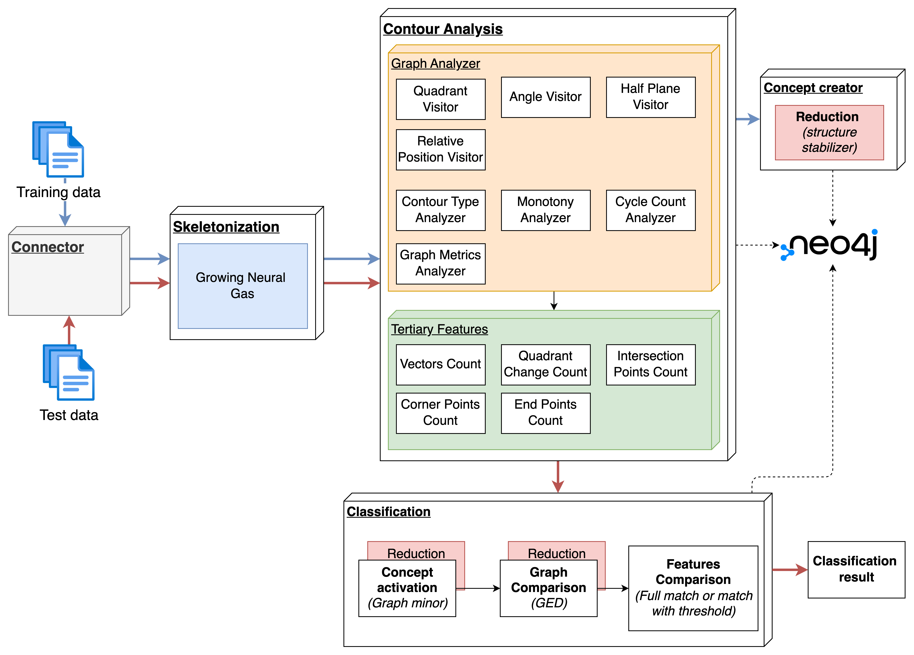

# NaturalAGI

NaturalAGI is a research project focused on developing a natural approach to Artificial General Intelligence through image processing, pattern recognition, and concept formation. The project implements a pipeline for processing visual data, extracting structural features, and forming abstract concepts through defined reduction rules. **The core goal is to build a classification algorithm that learns from training data without using backpropagation or traditional neural network approaches.**

## Project Overview

NaturalAGI implements a cognitive architecture that processes visual input through several stages:

1. **Pre-detection** - Initial processing of images to extract structural features
   - Documentation section: [Skeletonization](src/skeletonization/docs/SKELETON_SECTION.md)
2. **Contour Analysis** - Analysis of structural elements and their relationships
   - Documentation section: [Contour Analysis](src/contour_analysis/docs/CONTOUR_ANALYSIS_SECTION.md)
3. **Concept Formation** - Reduction to form abstract concepts
   - Documentation section: [Concept Formation](src/concept_creator/docs/CONCEPT_CREATION_SECTION.md)
4. **Classification** - Matching new inputs against formed concepts
   - Documentation section: [Classification](src/classification/docs/PAPER_SECTION.md)

Unlike traditional machine learning approaches that rely on backpropagation and gradient descent, NaturalAGI uses structural analysis and statistical reduction to form concepts. This approach is inspired by natural cognitive processes, where learning occurs through exposure to examples and statistical pattern recognition rather than explicit error correction.

The project is implemented as a set of microservices orchestrated through a Makefile-based workflow. Each component runs as a Nuclio serverless function, communicating through Kafka topics and storing structural representations in a Neo4j graph database.



## Key Components

### 1. Skeletonization

The skeletonization component uses the Growing Neural Gas (GNG) algorithm to create skeletal representations of images. This process:
- Converts images to binary skeletons
- Applies GNG to create a neural network representation
- Simplifies the network by identifying endpoints and intersections
- Converts the result to a NetworkX graph

### 2. Contour Analysis

The contour analysis module analyzes the structural elements of images, focusing on:
- Lines and their intersections
- Geometric and topological properties
- Vector magnitude and direction
- Critical points and angle points

The contour analysis process involves:
- Extracting points from the skeletonized image
- Identifying special points (endpoints, intersections)
- Creating vectors between connected points
- Calculating geometric properties (length, direction)
- Identifying critical features (angle points, quadrant changes)

#### Graph Representation

The structural elements are represented as a graph where:
- **Nodes** represent different elements in the image:
  - **Point nodes** with specific types:
    - Regular points
    - Endpoints
    - Intersections
    - Angle points
  - **Vector nodes** with types:
    - **Vector** (line that has been truncated to the angle points)
    - **HorizontalVector** (vector with more of horizontal direction)
    - **VerticalVector** (vector with more of vertical direction)

- **Relationships** connect the elements:
  - Points are connected to vectors via `:CONNECTED_TO` relationships
  - This creates a bipartite graph structure where points connect to vectors and vectors connect to points

#### Graph Persistence

The graph representation is persisted in a Neo4j database using the `GraphPersistenceService`:
- Points are stored as nodes with labels indicating their type (`:Point`, `:EndPoint`, `:IntersectionPoint`, etc.)
- Vectors are stored as nodes (not edges) with properties for coordinates and length, etc.
- Relationships connect points to vectors (`:CONNECTED_TO`)
- All elements are tagged with `image_id` and `session_id` for tracking

This graph-based representation enables:
- Topological analysis of image structures
- Feature extraction based on graph properties
- Comparison between different images using graph similarity algorithms
- Statistical reduction for concept formation

## System Architecture

The system is deployed as a set of microservices using:
- **Nuclio Functions** - Serverless functions for image processing
- **Kafka** - Message broker for communication between components
- **Neo4j** - Graph database for storing structural representations
- **Docker** - Containerization for deployment

## Getting Started

### Prerequisites

- Docker and Docker Compose
- Python 3.11+
- Poetry (for dependency management)

### Installation

1. Clone the repository:
   ```bash
   git clone https://github.com/yourusername/NaturalAGI.git
   cd NaturalAGI
   ```

2. Install dependencies:
   ```bash
   poetry install
   ```

### Running the System

The system can be run by executing the following command:

```bash
make
```

For help with available commands:
```bash
make help
```

## Project Structure

```
NaturalAGI/
├── src/                      # Source code
│   ├── skeletonization/      # Image skeletonization using GNG
│   ├── contour_analysis/     # Analysis of structural elements
│   │   ├── service/          # Services for analysis and persistence
│   │   ├── logic/            # Analysis algorithms
│   │   └── model/            # Data models for structural elements
│   ├── classification/       # Concept matching
│   ├── concept_creator/      # Concept formation
│   ├── connector/            # Communication between components
│   ├── post_processing/      # Statistical reduction
│   ├── training/             # Training models
│   └── samples_generator/    # Training data generation
├── common/                   # Shared utilities
├── docs/                     # Documentation
│   ├── README.md             # Detailed project description
│   ├── FEATURES.md           # Feature extraction documentation
│   ├── SIMULATION.md         # Simulation instructions
│   └── TRAINING.md           # Training process documentation
├── scripts/                  # Utility scripts
├── tests/                    # Test suite
│   └── generated_samples/    # Storage for test samples
├── training_data/            # Training datasets
├── Makefile                  # Build automation for deployment and execution
├── docker-compose.yaml       # Docker services configuration
├── pyproject.toml            # Poetry dependency management
└── .env                      # Environment variables
```

## Documentation

- [Skeletonization](src/skeletonization/docs/SKELETON_SECTION.md)
- [Contour Analysis](src/contour_analysis/docs/CONTOUR_ANALYSIS_SECTION.md)
- [Concept Formation](src/concept_creator/docs/CONCEPT_CREATION_SECTION.md)
- [Classification](src/classification/docs/PAPER_SECTION.md)

## Technologies Used

- **Python** - Primary programming language
- **OpenCV** - Image processing
- **scikit-image** - Image analysis
- **NetworkX** - Graph representation and analysis
- **Neo4j** - Graph database for storing structural representations
- **Nuclio** - Serverless functions for processing
- **Kafka** - Message broker for component communication
- **Docker** - Containerization for deployment
