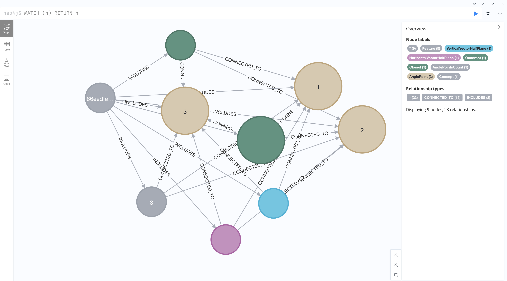
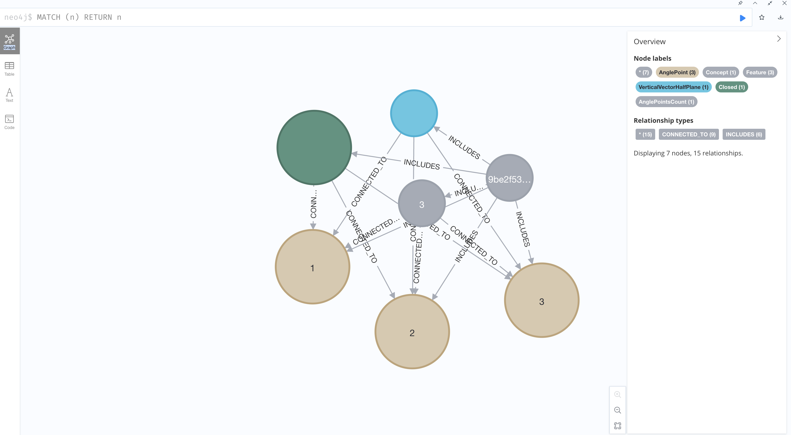

# Natural AGI description

## Table of Contents

1. [Features](./FEATURES.md)
2. [Pre-detectors](#pre-detectors)
   1. [Skeletonization](#1-skeletonization)

## 1. Skeletonization

For image skeletonization, we use the Growing Neural Gas (GNG) algorithm implemented in the skeletonization component. This approach creates a skeleton representation of the image that can be used for further processing and analysis. The output is provided as a NetworkX graph in JSON format.

### Details of SkeletonGNGMapper class

The `SkeletonGNGMapper` class is designed to process images and create skeletal representations using the Growing Neural Gas algorithm. This class is particularly useful in computer vision tasks where structural analysis and pattern recognition are essential. Below is a detailed description of the implementation.

#### Initialization

The class is initialized with settings parameters that control the GNG algorithm behavior:

```python
from pydantic_settings import BaseSettings
from ypstruct import structure

class Settings(BaseSettings):
    """Settings for the skeletonization component"""
    # Kafka configuration
    kafka_topic: str  # Topic to publish skeletonization results
    dlq_topic: str   # Dead letter queue topic for failed messages
    kafka_bootstrap_servers: str  # Comma-separated list of Kafka broker addresses
    kafka_group_id: str = "growing-neural-gas"  # Consumer group ID for Kafka

    # Growing Neural Gas (GNG) Network Parameters
    N: int = 40        # Maximum number of neurons in the network
    maxit: int = 100   # Maximum number of iterations for the GNG algorithm
    L: int = 40        # Number of iterations between adding new neurons
    epsilon_b: float = 0.2  # Learning rate for the winning neuron
    epsilon_n: float = 0.01  # Learning rate for the neighboring neurons
    alpha: float = 0.5      # Error reduction factor for winning neuron
    delta: float = 0.995    # Global error reduction factor
    T: int = 50            # Maximum age for edges in the network
    
    # Image Processing Parameters
    cnr_threshold: float = 0  # Corner detection threshold
    skeletonization_threshold: float = 160  # Threshold for binary image conversion
    simplification_epsilon: float = 1  # Epsilon value for Douglas-Peucker simplification
```

#### Methods

1. **process_image(image)**
   - This method handles the complete skeletonization pipeline, from initial image processing to final graph creation. It includes skeletonization, point extraction, GNG fitting, network simplification, and graph conversion.
2. **_skeletonize(image)**
   - Performs initial binary skeletonization using scikit-image's skeletonize function.
3. **_skeleton_to_points(skeleton)**
   - Converts the skeletonized image into a set of points for GNG processing.
4. **_fit_gng(points)**
   - Applies the Growing Neural Gas algorithm to the point set, creating a neural network representation of the skeleton.
5. **_simplify_network(net, epsilon)**
   - Simplifies the neural network by identifying endpoints and intersections, then processing segments using the Ramer-Douglas-Peucker algorithm.
6. **_to_networkx(simplified_network)**
   - Converts the simplified network into a NetworkX graph with labeled nodes and edge data


### Usage

The skeletonization component is deployed as a Nuclio function that processes images through Kafka messages. The function:

1. Receives image data through Kafka
2. Processes the image using SkeletonGNGMapper
3. Serializes the resulting graph
4. Sends the result back through Kafka

Note: Visualization can be used in the `skeletonization/experiments.ipynb`

## 2. Contour Analysis

The `contour_analysis` module is designed to analyze and process the structural elements of images, particularly focusing on lines and their intersections. This module is essential in computer vision tasks where understanding the geometric and topological properties of contours is crucial. Below is a detailed overview of the key components and their functionalities within the `contour_analysis` module.

### Key Components

1. **ContourAnalysisRepository**
   - This class manages the connection to the Neo4j database and orchestrates the contour analysis process. It initializes the database connection, processes input data, and triggers various analysis functions.
  
2. **Process Input Data**
   - This function processes the input data, which includes lines and angle points, and saves the relevant information to the database. It also handles the creation of critical points and the calculation of relative parameters.

3. **Data Saver**
   - This module includes functions to save vector and intersection data to the database. It ensures that all relevant properties and relationships are correctly stored.

4. **Magnitude and Direction Service**
   - This service calculates the magnitude and direction of vectors and creates nodes to represent these properties. It also handles the creation of critical points when there is a change in direction.

5. **Exposition Analyzer**
   - This module analyzes the contour development for a given image, determining whether the development is monotonic or non-monotonic based on the directions of the vectors.

6. **Angle Point and Vector Models**
   - These models define the structure of angle points and vectors, including their properties and relationships.

7. **Tertiary Features Service**
   - This service executes various strategies to extract tertiary features from the contour data, such as angle points and quadrant changes.

8.  **Graph Reduction Merger**
    - This module merges graphs of structural elements in the database by grouping similar elements and comparing their properties using Levenshtein distance.

### Usage
The `contour_analysis` module is used to analyze the structural elements of images, focusing on lines and their intersections. By processing input data, saving relevant properties, and analyzing the geometric relationships, this module provides a comprehensive understanding of the contours in an image. This is particularly useful in applications such as image analysis, computer vision, and pattern recognition, where accurate detection and analysis of structural elements are crucial.

## 3. Classification

The classification function is used to classify analyzed input image with the all the concepts that were formed before. To do that it uses the graph comparator. 
Algorythm:
1. Form a graph of the input image
2. Compare it with all the concepts using graph comparator
   - Features similarity. The classification function finds how many features are present in the input image and the concept. Then it calculates the Jaccard similarity between the features of the input image and the concept.
   - Structure similarity. The classification function create Neo4J graph projection of the input image structural nodes (Point, Vector) and the concept structural nodes. Then it calculates the similarity of the graphs using node similarity algorithm.
3. Return the most similar concept

## Experiments and Results

### Low number of images

The first experiment was to test the system with 10 images and analyze how they form the concept.

To form the concept system should extract only stable structures and features.
**Stable structures and features** are the ones that are present in all images.

The first experiment was with 12 images with triangle on them. There were no either other objects or "noise" on the images.

As a result we've got the concept with following features:
- 3 angle points
- Closed contour
- 3rd quadrant
- Lower Half Plane
- Left Half Plane




### High number of images

The second experiment was with the 117 images. There were no either other objects or "noise" on the images.

As a result we've got the concept with following features:
- 3 angle points
- Closed contour
- Left Half Plane



### Results

As an outcome we can be sure that size of the training set matters for the concept formation.