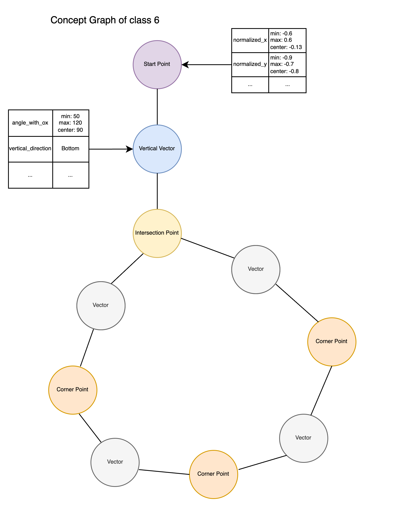
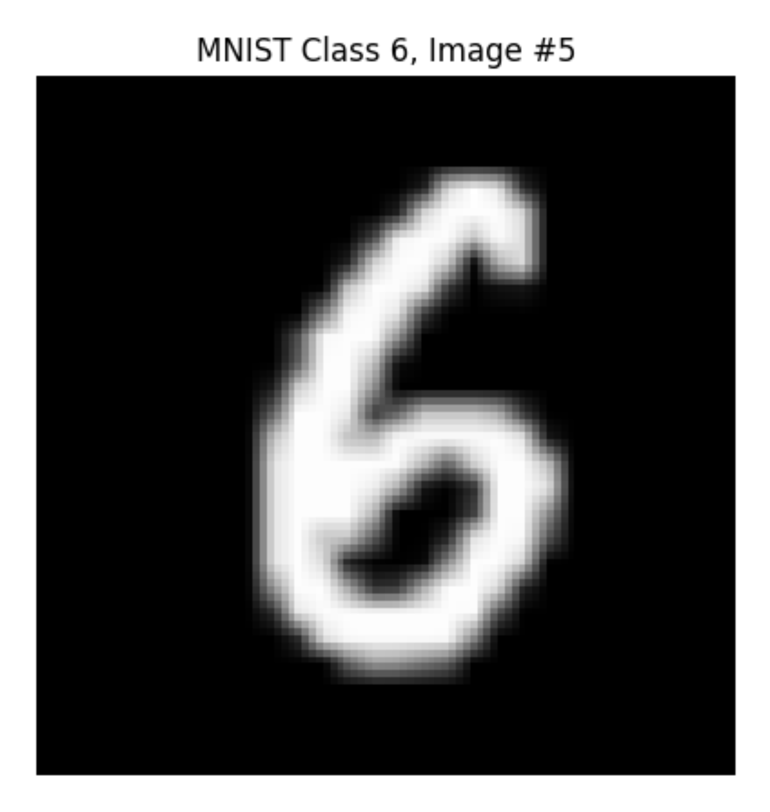
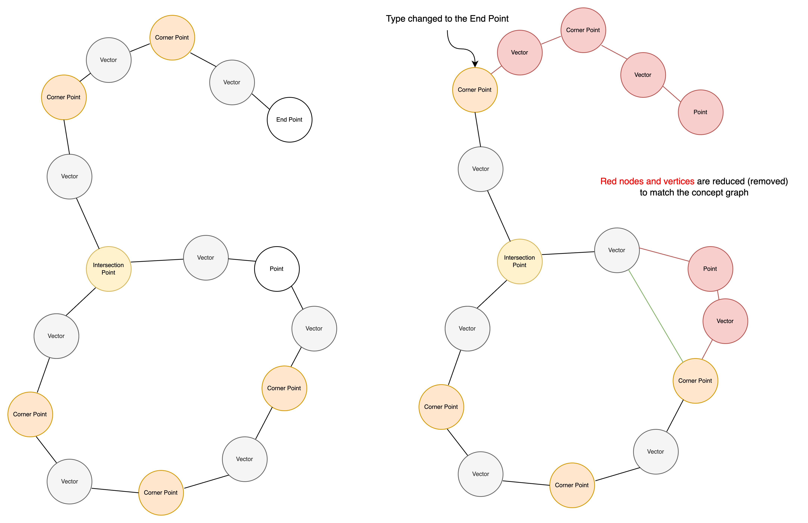
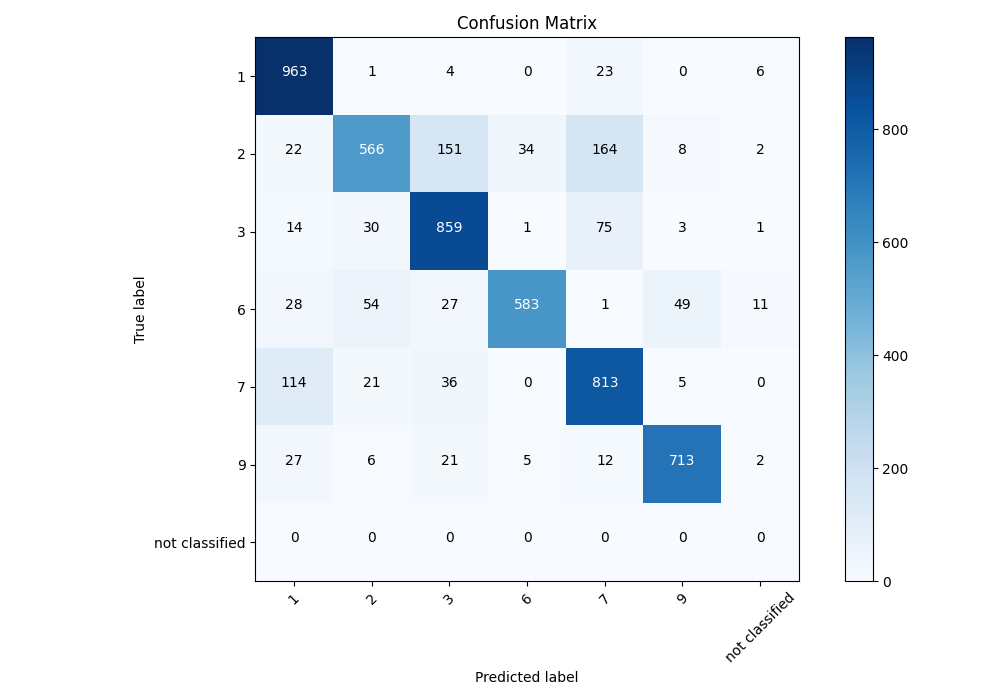

# Graph-Based Image Classification Through Concept Matching

## Table of Contents

### 3. Classification Function

#### 3.1 Introduction and Problem Statement

The classification function represents a critical component in the NaturalAGI framework, addressing the fundamental challenge of matching structural patterns in graph-based image representations against a repository of learned concepts. This process constitutes a specialized application of graph minor theory to pattern recognition, where the objective is to determine whether a given concept graph can be identified as a structural minor within a more complex image graph.

##### 3.1.1 Graph-based Concept Matching Problem

In the context of structural image analysis, the classification problem can be formally defined as follows: given an image graph G_image derived from contour analysis and a set of concept graphs {C_1, C_2, \dots, C_n} representing previously learned patterns (Figure 1), the task is to identify which concepts, if any, are structurally present within the image. This problem transcends simple graph isomorphism, as it requires identifying partial structural matches that preserve essential topological and geometric relationships while allowing for variations in non-critical features.



*Figure 1: Example of concept graph*
<br>

The fundamental challenge lies in the asymmetric nature of this comparison. Unlike traditional graph matching problems where both graphs are treated equally, concept classification requires preserving the integrity of concept graphs while allowing controlled reduction and transformation of image graphs. This asymmetry reflects the semantic distinction between learned concepts, which represent canonical structural patterns, and image graphs, which may contain additional complexity, noise, or contextual elements that do not affect the presence of the underlying concept.



*Figure 2: MNIST sample image*
<br>



*Figure 3: Example of reduction*
<br>

##### 3.1.2 Minor Graph Isomorphism in Pattern Recognition

The application of graph minor theory to pattern recognition introduces several unique considerations. In classical graph minor problems, the focus is typically on determining whether one graph can be obtained from another through a series of edge contractions and vertex deletions. However, in the context of concept classification, the problem is augmented with additional constraints related to semantic preservation and geometric consistency.

The concept of "minorness" in this context is not purely topological but incorporates semantic and geometric constraints that ensure meaningful pattern recognition. Critical points, geometric relationships, and structural properties must be preserved during the matching process, creating a constrained minor identification problem. This constraint ensures that identified matches correspond to genuine instances of learned concepts rather than arbitrary topological similarities.

Furthermore, the problem is complicated by the need to maintain computational efficiency while processing potentially large concept repositories. The classification system must rapidly eliminate obviously incompatible concepts while performing detailed analysis only on promising candidates. This requirement introduces the need for sophisticated pre-filtering mechanisms based on structural complexity measures.

##### 3.1.3 Challenges in Structural Graph Comparison

Several significant challenges emerge in the implementation of effective structural graph comparison for concept classification:

**Complexity Management**: The computational complexity of graph minor identification is well-known to be intractable in the general case. However, the specific structure of graphs derived from image analysis, with their emphasis on spatial relationships and limited node types, provides opportunities for optimization. The challenge lies in exploiting these structural properties while maintaining generality across diverse image types and concept categories.

**Scale Variance**: Image graphs and concept graphs often exist at different scales of detail. An image may contain fine-grained structural elements that are not present in abstract concept representations, or conversely, concepts may encode relationships that are implicit rather than explicit in image graphs. The classification system must handle these scale differences gracefully, identifying essential structural similarities while being robust to variations in detail level.

**Feature Heterogeneity**: Nodes and edges in both image and concept graphs carry rich semantic information including geometric properties, spatial relationships, and topological characteristics. The challenge lies in developing comparison mechanisms that appropriately weight different types of features, handle missing or inconsistent feature values, and maintain semantic coherence during the matching process.

**Performance Requirements**: In practical applications, classification must be performed efficiently across large concept repositories. The system must balance accuracy with computational efficiency, employing strategies such as parallel processing, early termination criteria, and hierarchical filtering to achieve acceptable performance while maintaining classification quality.

**Robustness and Noise Tolerance**: Real-world image analysis introduces various forms of noise and variability that must be accommodated without compromising classification accuracy. The system must distinguish between meaningful structural variations that indicate the absence of a concept and minor perturbations that should be tolerated during matching.

These challenges collectively define the scope and complexity of the graph-based classification problem, establishing the requirements for the algorithmic approaches and architectural decisions that follow in subsequent sections.

#### 3.2 Theoretical Foundation

The theoretical foundation of the classification function rests on three interconnected mathematical frameworks: graph minor theory adapted for semantic pattern recognition, critical point preprocessing for structural reduction, and complexity-based filtering for computational optimization. These frameworks collectively provide the mathematical basis for efficient and accurate concept matching in graph-based image representations.

##### 3.2.1 Graph Minor Theory and Concept Representation

The application of graph minor theory to concept classification requires a semantic extension of classical graph-theoretic definitions. In the traditional formulation, a graph H is a minor of graph G if H can be obtained from G through a sequence of vertex deletions, edge deletions, and edge contractions. However, for concept classification, this definition must be augmented to preserve semantic and geometric constraints inherent in image-derived graph structures.

**Semantic Graph Minor Definition**: A concept graph C is considered a semantic minor of an image graph I if there exists a mapping φ: V(C) → V(I) such that:
1. The mapping preserves essential structural relationships between critical points
2. Geometric properties of mapped nodes remain within defined tolerance bounds
3. The induced subgraph of I maintains the topological connectivity of C
4. Semantic labels and feature hierarchies are preserved or compatible

This definition extends classical minor theory by incorporating domain-specific constraints that ensure meaningful pattern recognition rather than arbitrary structural similarity. The preservation of critical points ensures that geometrically significant features, such as intersections, endpoints, and corner points, maintain their semantic roles during the matching process.

**Concept Graph Representation**: Concept graphs are constructed as canonical representations of learned structural patterns, where nodes represent critical points with associated geometric and semantic properties, and edges encode spatial relationships and connectivity patterns. The representation maintains a hierarchical feature structure, distinguishing between high-level structural properties (such as connectivity patterns and topological characteristics) and low-level geometric properties (such as angular measurements and spatial coordinates).

The semantic enrichment of concept graphs enables the encoding of tolerance ranges for geometric properties, allowing concepts to match image structures with reasonable geometric variation while maintaining essential structural characteristics. This flexibility is crucial for robust pattern recognition in real-world scenarios where exact geometric correspondence is unlikely.

##### 3.2.2 Critical Point Preprocessing Framework

Critical point preprocessing provides the theoretical foundation for controlled graph reduction that preserves essential structural information while eliminating redundant complexity. The framework is based on the principle that structural patterns can be effectively characterized by their critical points and the relationships between them.

**Critical Point Classification**: The preprocessing framework establishes a taxonomy of critical points based on their structural significance:
- **Intersection Points**: Nodes representing the convergence of multiple structural elements, characterized by degree ≥ 3 in the graph representation
- **Endpoint Points**: Terminal nodes of structural elements, representing boundaries or terminations of contour segments
- **Corner Points**: Nodes representing significant directional changes in contour development, identified through angular analysis

**Reduction Strategies**: The theoretical framework defines three primary reduction strategies that maintain semantic coherence while simplifying graph structure:

1. **Endpoint Reduction Strategy**: Based on the principle that isolated terminal segments often represent noise or minor structural variations that do not affect core pattern identity. The strategy employs similarity-based clustering to identify and merge endpoint configurations that represent the same underlying structural feature.

2. **Intersection Reduction Strategy**: Addresses the consolidation of closely spaced intersection points that represent the same underlying structural junction. The theoretical basis rests on the assumption that minor variations in intersection positioning do not fundamentally alter the structural pattern being represented.

3. **Corner Point Reduction Strategy**: Employs geometric analysis to identify and consolidate corner points that represent the same directional change but may be fragmented due to discretization or noise in the image analysis process.

**Preservation Invariants**: The preprocessing framework maintains several critical invariants:
- **Topological Connectivity**: The fundamental connectivity structure of the graph must be preserved
- **Geometric Consistency**: Reduction operations must not introduce geometric inconsistencies that alter the essential shape characteristics
- **Semantic Coherence**: The semantic meaning of structural elements must be maintained throughout the reduction process

##### 3.2.3 Complexity-Based Filtering Strategy

The complexity-based filtering strategy provides a theoretical framework for early elimination of incompatible concept-image pairs, based on the fundamental principle that a concept cannot be a minor of an image if it possesses greater structural complexity than the image itself.

**Complexity Metrics**: The theoretical foundation defines a single complexity measure:

**Structural Complexity**: Quantified as a function of node count and edge count. For a graph G = (V, E), the structural complexity is defined as
```math
C_S(G) = |V| + |E|
```
representing the total number of structural elements in the graph. This metric provides a computationally efficient measure of graph size while maintaining the essential property that larger, more connected graphs have higher complexity values.

**Filtering Criteria**: The complexity-based filtering employs several theoretical principles:

**Monotonicity Principle**: If
```math
\operatorname{complexity}(C) > \operatorname{complexity}(I)
```
then C cannot be a semantic minor of I. This principle provides the theoretical justification for early elimination of obviously incompatible concept-image pairs.

**Complexity Preservation**: Graph reduction operations must be complexity-monotonic, meaning that the complexity of a reduced graph cannot exceed the complexity of the original graph. This ensures that complexity-based filtering remains valid throughout the preprocessing pipeline.

**Efficiency Bounds**: The filtering strategy provides theoretical efficiency bounds for the classification process. By eliminating a fraction f of concepts through complexity filtering, the overall computational complexity is reduced by a factor of (1-f), providing significant performance improvements for large concept repositories.

**Multi-level Filtering**: The theoretical framework supports hierarchical filtering strategies where concepts are organized into complexity classes, enabling progressive refinement of candidate sets. This approach provides logarithmic improvements in average-case performance while maintaining theoretical guarantees for worst-case scenarios.

The integration of these three theoretical frameworks—semantic graph minor theory, critical point preprocessing, and complexity-based filtering—provides a mathematically sound foundation for the classification function that balances accuracy, efficiency, and robustness in practical applications.

#### 3.3 Classification Architecture

The classification architecture embodies a multi-layered design that addresses the dual challenges of computational efficiency and scalability while maintaining classification accuracy. The architecture employs a hierarchical approach that separates high-level orchestration concerns from low-level graph processing operations, enabling both sequential and parallel execution modes depending on system resources and workload characteristics.

##### 3.3.1 Orchestration and Workflow Management

The orchestration layer serves as the primary coordination mechanism for classification tasks, implementing a sophisticated workflow management system that adapts to varying computational resources and handles the complexities of large-scale concept repository processing.

**Multi-process Classification Pipeline**

The pipeline architecture implements a work distribution model that leverages available computational resources through dynamic process allocation. The system employs a master-worker paradigm where the orchestration layer partitions the concept repository into discrete work units, each representing a single concept-image comparison task. This granular decomposition enables efficient load balancing and fault isolation, ensuring that the failure of individual comparison operations does not compromise the overall classification process.

The pipeline maintains strict separation between data preparation and computation phases. Work packages are constructed to include all necessary data and configuration parameters, eliminating shared state dependencies that could introduce synchronization overhead or data consistency issues in multi-process environments. This design principle ensures that individual worker processes can operate independently, maximizing parallelization potential and system throughput.

**Dynamic Resource Allocation**

The resource allocation mechanism employs adaptive algorithms that determine optimal worker process counts based on system characteristics and workload requirements. The allocation strategy considers multiple factors including available CPU cores, memory constraints, and the size of the concept repository being processed. The system implements conservative defaults that prevent resource over-subscription while providing manual override capabilities for specialized deployment scenarios.

The allocation algorithm incorporates feedback mechanisms that monitor process utilization and adjust resource allocation in response to changing system conditions. This adaptive approach ensures efficient resource utilization across diverse hardware configurations while maintaining system stability under varying load conditions.

**Fault Tolerance and Error Handling**

The architecture implements comprehensive fault tolerance mechanisms that address both systematic and transient failure modes. Individual concept comparison failures are isolated and handled gracefully, allowing the overall classification process to continue while capturing detailed error information for diagnostic purposes. The system employs timeout mechanisms to prevent indefinite blocking on problematic concept comparisons, ensuring predictable completion times even when processing challenging concept-image pairs.

Error recovery strategies distinguish between recoverable and non-recoverable failure modes. Transient failures, such as temporary resource constraints or network connectivity issues, trigger automatic retry mechanisms with exponential backoff algorithms. Systematic failures, such as malformed graph data or algorithmic incompatibilities, are logged and reported while allowing the classification process to continue with remaining concepts.

##### 3.3.2 Graph Preprocessing Pipeline

The preprocessing pipeline implements a sequential series of transformation and enrichment operations that prepare both image and concept graphs for efficient comparison. The pipeline design emphasizes data consistency and semantic preservation while optimizing graph representations for subsequent matching algorithms.

**Start Point Selection Strategy**

The start point selection mechanism addresses the fundamental challenge of establishing consistent traversal origins for graph comparison operations. The strategy employs geometric and topological analysis to identify optimal starting points that provide stable reference frames for subsequent graph traversal and feature extraction processes.

The selection algorithm implements a multi-criteria evaluation framework that considers both local node properties and global graph characteristics. Local criteria include node degree, critical point classification, and geometric positioning relative to graph centroids. Global criteria incorporate structural connectivity patterns and the distribution of critical points throughout the graph structure.

The strategy accommodates different graph topologies through adaptive selection algorithms that adjust their behavior based on structural characteristics. Open graphs, characterized by the presence of endpoint nodes, employ centroid-based distance minimization to identify optimal starting positions. Closed graphs utilize connectivity analysis and geometric distribution patterns to establish consistent traversal origins that provide comprehensive graph coverage.

**Critical Point Extraction**

The critical point extraction process implements the theoretical framework established in the preprocessing foundation, applying systematic analysis to identify and classify structurally significant nodes within graph representations. The extraction mechanism employs multi-stage analysis that combines topological examination with geometric property assessment to ensure comprehensive identification of critical structural elements.

The extraction process maintains taxonomic consistency through standardized classification algorithms that assign critical point types based on well-defined structural and geometric criteria. Intersection points are identified through degree analysis and connectivity pattern recognition. Corner points are detected through angular analysis and directional change identification. Endpoint classification employs degree analysis.

**Feature Enhancement Through Visitors Pattern**

The feature enhancement mechanism employs the visitor design pattern to implement extensible graph analysis that enriches node and edge representations with computed features relevant to classification operations. The pattern enables systematic traversal of graph structures while applying specialized analysis algorithms that extract and persist relevant geometric, topological, and semantic features.

The visitor implementation supports multiple analysis types that can be composed and applied in configurable combinations. Angular visitors compute and store directional information and angular relationships between connected structural elements. Quadrant visitors analyze spatial positioning and distribute geometric features based on coordinate system divisions. Direction visitors extract and classify directional patterns and movement characteristics throughout graph structures.

The enhancement process maintains feature consistency and completeness through standardized visitor interfaces that ensure uniform feature extraction and storage patterns. Visitors operate on consistent graph representations and employ standardized property naming conventions that facilitate subsequent comparison operations. The pattern's extensibility enables the incorporation of additional analysis types without requiring modifications to core traversal or orchestration logic.

The visitor-based enhancement integrates seamlessly with the broader preprocessing pipeline, accepting preprocessed graphs as input and producing fully enriched representations suitable for sophisticated similarity assessment operations. The enhanced graphs maintain all original structural and semantic information while providing expanded feature sets that enable more nuanced and accurate concept matching algorithms.

#### 3.4 Core Classification Algorithm

The core classification algorithm implements a sequential pipeline that combines complexity-based filtering, graph preprocessing, and similarity assessment to determine whether a concept graph can be identified as a semantic minor within an image graph. The algorithm embodies the theoretical foundations established in previous sections while providing practical mechanisms for efficient and accurate concept matching.

##### 3.4.1 Complexity Pre-filtering

The algorithm's first step is a complexity-based pre-filtering stage, which serves as the primary optimization for the entire classification process. This stage applies the monotonicity principle, as defined in the theoretical foundation (Section 3.2.3), to rapidly eliminate concept-image pairs that are fundamentally incompatible.

The filtering mechanism compares the structural complexity of the concept and image graphs. If the concept's complexity, $C_S(\text{concept})$, is greater than the image's, $C_S(\text{image})$, it is immediately rejected without further processing. This early rejection provides significant computational savings, particularly for large concept repositories, by ensuring that the more resource-intensive stages of the algorithm are only performed on viable candidates.

##### 3.4.2 Graph Reduction and Alignment

Following successful complexity pre-filtering, the algorithm proceeds to graph reduction and alignment operations that prepare both image and concept graphs for detailed similarity assessment. This stage implements the critical point preprocessing framework while maintaining semantic coherence and structural integrity.

**Image Graph Reduction Strategies**

The reduction process applies a sequential series of specialized reduction strategies designed to consolidate redundant critical points while preserving essential structural characteristics. The algorithm employs three primary reduction strategies that operate iteratively until graph convergence or maximum iteration limits are reached.

Endpoint reduction addresses terminal nodes that may represent noise or minor structural variations. The strategy employs similarity-based clustering to identify endpoint configurations that represent the same underlying structural feature. Consolidation decisions are based on geometric proximity, semantic compatibility, and topological relationships within the broader graph structure.

Intersection reduction focuses on closely spaced intersection points that represent the same underlying structural junction. The reduction algorithm employs geometric analysis to identify intersection clusters and applies consolidation rules that maintain topological connectivity while simplifying the critical point structure.

Corner point reduction targets directional change points that may be fragmented due to discretization effects or noise in the original image analysis. The strategy employs angular analysis to identify corner point sequences that represent single directional changes and consolidates them into unified critical point representations.

**Concept Graph Preservation**

The algorithm maintains strict preservation of concept graph structure throughout the reduction process. Concept graphs represent canonical structural patterns that must remain unmodified to ensure meaningful comparison operations. The preservation principle ensures that concept graphs retain their semantic integrity and structural completeness, enabling accurate minor identification.

The asymmetric treatment of image and concept graphs reflects the fundamental distinction between learned patterns and observed structures. Image graphs may contain additional complexity, noise, or contextual elements that do not affect the presence of underlying concepts, while concept graphs embody essential structural relationships that must be preserved for accurate pattern recognition.

**Critical Point Matching**

The alignment process establishes correspondence between critical points in reduced image graphs and concept graphs through systematic geometric and semantic analysis. The matching algorithm employs multi-criteria evaluation that considers node degree, critical point classification, geometric positioning, and semantic properties.

Start point alignment provides consistent reference frames for subsequent traversal and comparison operations. The algorithm employs centroid-based positioning analysis to identify optimal start point correspondences that enable comprehensive graph coverage and stable comparison results.

The matching process incorporates validation mechanisms that ensure established correspondences maintain semantic coherence and geometric consistency. Validation criteria include topological relationship verification, property completeness assessment, and structural compatibility confirmation.

##### 3.4.3 Similarity Assessment Framework

The similarity assessment framework implements sophisticated graph comparison algorithms that quantify the degree of structural correspondence between reduced image graphs and concept graphs. The framework combines graph edit distance computation with specialized cost functions that account for semantic and geometric properties.

**Graph Edit Distance Computation**

The assessment employs optimal edit path algorithms that determine the minimum cost sequence of graph transformation operations required to transform the image graph into the concept graph. The computation considers node insertions, deletions, and substitutions, as well as edge operations, providing comprehensive structural comparison capabilities.

The edit distance calculation operates under timeout constraints to ensure predictable completion times and prevent indefinite blocking on computationally challenging graph pairs. Timeout mechanisms maintain system responsiveness while providing graceful degradation for problematic concept-image combinations.

**Node Substitution Cost Functions**

The node substitution cost assessment implements hierarchical evaluation that considers label compatibility, property similarity, and feature completeness. The cost function first verifies semantic compatibility through label subset relationships, requiring that concept node labels form a subset of image node labels to ensure meaningful correspondence.

Property similarity assessment employs type-specific comparison algorithms that handle numeric values, ranges, strings, and lists according to their semantic characteristics. Numeric comparisons employ tolerance-based matching that accommodates minor geometric variations while maintaining structural precision. Range-based comparisons evaluate containment relationships and distance-from-center metrics to quantify similarity levels.

The cost function implements feature-level analysis that distinguishes between high-level structural properties and low-level geometric characteristics. The hierarchical approach enables appropriate weighting of different property types while maintaining semantic coherence throughout the comparison process.

**Edge Matching Criteria**

Edge matching employs simplified comparison algorithms that focus on connectivity preservation rather than detailed edge property analysis. The matching criteria prioritize topological relationships over specific edge attributes, reflecting the emphasis on structural pattern recognition rather than detailed geometric correspondence.

The edge comparison process supports the overall similarity assessment by ensuring that structural connectivity patterns are appropriately weighted in the final similarity calculation. Edge operations contribute to the total edit distance while maintaining proportional influence relative to node-based operations.

The similarity assessment concludes with normalization operations that convert edit distance measurements into similarity scores ranging from 0.0 to 1.0. The normalization process considers maximum possible edit costs based on graph sizes, ensuring that similarity scores provide meaningful comparison metrics across diverse concept-image pairs.

#### 3.5 Feature-Based Comparison System

The feature-based comparison system implements hierarchical node property analysis within the graph edit distance computation framework. Rather than operating as a separate comparison layer, feature analysis is integrated directly into the node substitution cost functions, enabling sophisticated property-level similarity assessment during the core matching process.

##### 3.5.1 Unified Feature Comparison

The feature analysis framework has been streamlined to utilize a unified set of predefined properties for comparing nodes. This approach simplifies the comparison logic by removing the previous hierarchical distinction between high-level structural features and low-level geometric properties.

The system employs a single, curated list of features deemed relevant for similarity assessment, including both structural (`segments`) and geometric (`normalized_x`, `normalized_y`, `horizontal_direction`, `vertical_direction`) attributes.

During the node substitution cost calculation, the algorithm identifies the subset of these predefined features that are present in both the image node and the concept node. The final similarity cost is calculated based only on this common set of properties. This dynamic selection ensures that nodes are compared only on the basis of mutually available information, providing a robust and fair assessment. The weighting is distributed equally among the features in this common set, as detailed in the following section.

##### 3.5.2 Similarity Metrics and Cost Functions

The similarity assessment framework implements type-specific comparison algorithms that accommodate the diverse data types and semantic characteristics present in node property representations. The framework provides specialized handling for numeric values, range specifications, string comparisons, and list-based feature sets, ensuring that comparisons are semantically appropriate for each property type.

**Node Property Comparison**

The cornerstone of the similarity framework is the node substitution cost function, which quantifies the dissimilarity between a node from the image graph ($n_i$) and a node from the concept graph ($n_c$). The computation begins by verifying label compatibility, a prerequisite for any further comparison. If the set of labels on the concept node is not a subset of the labels on the image node, the nodes are considered incompatible, and an infinite cost is assigned.

**Mathematical Formulation of Cost Functions**

The overall node substitution cost is defined as:

```math
C_{\text{node}}(n_i, n_c) =
\begin{cases}
  \infty, & \text{if } \operatorname{labels}(n_c) \not\subseteq \operatorname{labels}(n_i) \\
  C_{\text{props}}(n_i, n_c), & \text{otherwise}
\end{cases}
```

If the labels are compatible, the cost is determined by the cumulative dissimilarity of their shared properties, denoted as $C_{\text{props}}(n_i, n_c)$. This function aggregates the comparison costs of individual properties that are common to both nodes and are part of a predefined set of comparable features.

Let $P_i$ be the set of properties in the image node, $P_c$ be the set of properties in the concept node, and $F$ be the set of predefined features considered for comparison. The set of properties to be compared, $P_{\text{compare}}$, is the intersection of these three sets: $P_{\text{compare}} = P_i \cap P_c \cap F$.

The property similarity cost is then calculated as the sum of individual property costs, where each property's cost is capped to ensure that a single mismatched property does not disproportionately influence the total cost. The contribution of each property is weighted equally. The formula is:

```math
C_{\text{props}}(n_i, n_c) = \sum_{p \in P_{\text{compare}}} \min\left(C_{\text{prop}}(v_i^p, v_c^p), \frac{1}{|P_{\text{compare}}|}\right)
```

where $C_{\text{prop}}(v_i^p, v_c^p)$ is the type-specific cost function for a given property $p$. This formulation results in a total cost between 0.0 (for a perfect match) and 1.0 (for a total mismatch across all compared properties). If the set $P_{\text{compare}}$ is empty, a maximum mismatch cost is returned.

**Type-Specific Cost Functions**

To handle the heterogeneity of property data, the framework employs specialized cost functions for different value types:

Numeric property comparison implements tolerance-based matching to account for minor floating-point discrepancies:

```math
C_{\text{numeric}}(v_i, v_c) =
\begin{cases}
  0.0, & \text{if } |v_i - v_c| < 1 \times 10^{-10} \\
  1.0, & \text{otherwise}
\end{cases}
```

Range-based property comparison provides a graduated cost for numeric values that fall within a concept's specified range. The cost is proportional to the value's distance from the center of the range, encouraging matches closer to the ideal value:

```math
C_{\text{range}}(v_i, r_c) =
\begin{cases}
  1.0, & \text{if } v_i \notin [r_{\min}, r_{\max}] \\
  0.0, & \text{if } r_{\max} = r_{\min} \\
  \frac{|v_i - r_{\text{center}}|}{r_{\text{width}}/2} \times C_{\max}, & \text{if } v_i \in [r_{\min}, r_{\max}]
\end{cases}
```

where $r_{\text{width}} = r_{\max} - r_{\min}$, and $C_{\max}$ is the maximum possible cost for that property (i.e., $1/|P_{\text{compare}}|$).

String comparison employs case-insensitive categorical matching:

```math
C_{\text{string}}(s_i, s_c) =
\begin{cases}
  0.0, & \text{if } \operatorname{lowercase}(s_i) = \operatorname{lowercase}(s_c) \\
  1.0, & \text{otherwise}
\end{cases}
```

List comparison implements subset relationship evaluation, which allows an image node's property to be a superset of the concept's requirement:

```math
C_{\text{list}}(L_i, L_c) =
\begin{cases}
  0.0, & \text{if } L_c \subseteq L_i \\
  1.0, & \text{otherwise}
\end{cases}
```

This multi-faceted approach ensures that concept specifications can be satisfied by more detailed or comprehensive image characterizations while upholding strict compatibility requirements for the core features.

**Structural Compatibility Assessment**

Structural compatibility assessment operates at the semantic level, requiring that concept node labels form subsets of image node labels. This compatibility requirement ensures that node correspondences maintain semantic coherence while allowing for additional specificity in image node characterization.

The assessment process implements strict compatibility verification that immediately rejects node pairs with incompatible semantic labels. This early filtering mechanism prevents inappropriate correspondences that could compromise the overall matching quality while reducing computational overhead for obviously incompatible node combinations.

**Tolerance-based Matching**

Tolerance mechanisms are integrated throughout the comparison framework to accommodate natural variation in geometric and spatial properties while maintaining meaningful discrimination capabilities. Numeric tolerance employs precision-based thresholds that distinguish between effectively equivalent values and meaningfully different measurements.

Range-based tolerance implements graduated cost assessment that provides smooth similarity gradation based on position within acceptable ranges. Values closer to range centers receive lower cost assessments, while values near range boundaries incur higher costs without triggering complete rejection. This approach maintains nuanced similarity assessment while accommodating the inherent imprecision in real-world geometric measurements.

The tolerance framework balances flexibility with discrimination capability, ensuring that minor measurement variations do not prevent valid concept matches while maintaining sufficient precision to distinguish between genuinely different structural configurations.

#### 3.6 Performance Optimization

To ensure the classification system operates efficiently, particularly when processing large concept repositories against complex images, several key performance optimization strategies are employed. These strategies focus on reducing the overall computational load through parallel processing and managing the inherent complexity of graph comparison algorithms.

##### 3.6.1 Parallel Processing Strategy

The classification architecture is designed for horizontal scalability through a concept-level parallelization strategy. The system implements a master-worker paradigm using a process pool that distributes the workload of comparing an image against numerous concepts across multiple CPU cores.

**Concept-level Parallelization**
The core of the strategy involves partitioning the concept repository into individual work units, where each unit represents a single concept-to-image comparison task. The orchestration layer submits these tasks to a `multiprocessing.Pool`, allowing the operating system to manage the scheduling and execution of these tasks across available processors. This approach is highly effective because each comparison is an independent operation, requiring no inter-process communication, thus minimizing synchronization overhead and maximizing throughput. The number of worker processes is dynamically configured based on the available system cores, ensuring optimal resource utilization.

**Load Balancing and Fault Tolerance**
This parallel architecture provides implicit load balancing, as the operating system assigns new tasks to worker processes as soon as they become free. This ensures that processing resources remain consistently engaged. Furthermore, the design enhances fault tolerance. An error or exception within a single concept comparison task is isolated to its respective process, preventing it from halting the entire classification pipeline. The main orchestrator can handle such failures gracefully, logging the issue while allowing other comparisons to proceed uninterrupted.

##### 3.6.2 Computational Complexity Management

The primary bottleneck in the classification algorithm is the graph edit distance (GED) computation, which is known to be NP-hard in the general case. To mitigate this, the system incorporates two critical mechanisms: complexity-based pre-filtering and timeout-constrained execution.

**Complexity Pre-filtering**
As detailed in section 3.4.1, the first line of defense against computational intractability is the complexity pre-filtering stage. By performing a computationally inexpensive check ($O(|V| + |E|)$), the algorithm immediately rejects any concept graph that is structurally more complex than the image graph. This step dramatically reduces the number of candidate concepts that must undergo the more expensive GED analysis, significantly improving overall performance, especially with large and diverse concept repositories.

**Timeout-Constrained Graph Matching**
For concepts that pass the pre-filtering stage, the GED computation is performed within a strictly enforced time limit. A timeout is applied to the graph matching function, ensuring that the system does not become stalled on computationally challenging graph pairs that could otherwise consume excessive resources and time. If a comparison exceeds the allocated time, it is terminated, and the concept is marked as a non-match. This pragmatic approach ensures predictable performance and system responsiveness, trading exhaustive comparison in edge cases for guaranteed completion time across the entire concept set. This is crucial for maintaining throughput in a production environment where timely results are paramount.

#### 3.7 Quality Assessment and Validation

The quality of the classification system is assessed through a combination of quantitative metrics and the nuanced interpretation of a continuous similarity score. This section details the validation framework and presents results from a representative test run (`run_20250620_183851`) conducted on a dataset of 4,734 images across six distinct classes.

##### 3.7.1 Classification Accuracy Metrics

To quantitatively evaluate the classifier's performance, a labeled dataset containing images and their corresponding ground-truth concepts is used. Based on a predefined similarity threshold, any concept match producing a score above this threshold is considered a positive prediction.

In the reference test run, the system achieved a high level of overall accuracy. The key performance indicators were as follows:
- **Accuracy**: 82.4%
- **Precision**: 83.3%
- **Recall**: 82.4%
- **F1-Score**: 82.3%

These metrics indicate a robust and well-balanced classifier. The F1-Score, being the harmonic mean of precision and recall, suggests that the system maintains a strong balance between correctly identifying concepts and not making false claims. Further analysis of per-class metrics reveals variance in performance, with certain classes (e.g., class '6' with 93.6% precision) being identified more reliably than others (e.g., class '2' with 59.8% recall), indicating areas for future targeted improvements.

##### 3.7.2 Similarity Score Interpretation

The primary output for any concept-image pair is a similarity score between 0.0 and 1.0, derived from the Graph Edit Distance (GED). This score provides a more intuitive measure of structural correspondence than the raw GED cost. The conversion is performed by normalizing the raw GED cost against the maximum possible cost and subtracting the result from 1. A score of 1.0 thus signifies a perfect match, while a score near 0.0 indicates a complete mismatch. This continuous score is crucial for ranking potential matches and is the basis for the thresholding decision that produces the final classification.

##### 3.7.3 False Positive and Negative Analysis

The selection of an appropriate similarity threshold is critical for balancing the trade-off between false positives and false negatives. A visual analysis of the `confusion_matrix.png` generated during the test run provides insight into the specific inter-class confusions driving these errors.

- **False Positives (Type I Error)**: Occur when an incorrect concept is matched with a score above the threshold. For example, the confusion matrix may reveal that images of class '2' are sometimes misclassified as class '3'. Such errors often arise from shared sub-structural similarities.
- **False Negatives (Type II Error)**: Occur when a correct concept is rejected for falling below the threshold. The lower recall for class '2' (59.8%) suggests that these images may contain significant noise or structural variations that inflate the graph edit distance, causing them to be missed.

A detailed log of all incorrect classifications is maintained (e.g., `incorrect_results.csv`) to facilitate in-depth error analysis. By studying the characteristics of misclassified examples, the cost functions and graph preprocessing stages can be iteratively refined to improve the classifier's accuracy and reliability.




#### 3.8 Integration with NaturalAGI Pipeline
- 3.8.1 Input Interface from Contour Analysis
- 3.8.2 Concept Repository Integration
- 3.8.3 Result Persistence and Retrieval

#### 3.9 Limitations and Future Improvements
- 3.9.1 Current Algorithm Limitations
- 3.9.2 Scalability Considerations
- 3.9.3 Enhancement Opportunities

#### 3.10 Conclusion
- 3.10.1 Key Contributions
- 3.10.2 Performance Characteristics
- 3.10.3 Role in Overall NaturalAGI Framework
