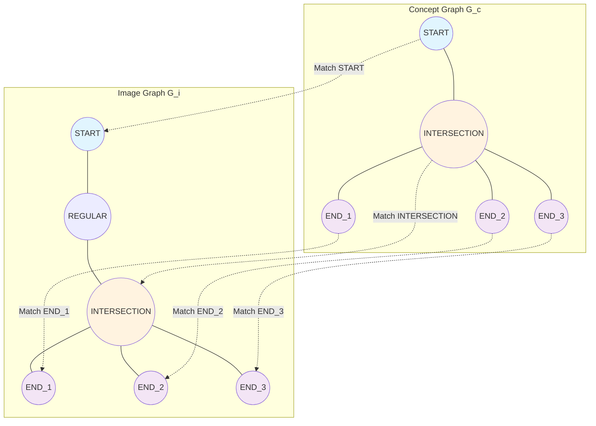

# Graph-Based Concept Formation Through Iterative Structural Intersection

## 4. Concept Creation Function

### 4.1 Introduction and Problem Statement

The concept creation function addresses the fundamental challenge of learning abstract structural representations from multiple training examples without relying on traditional gradient-based optimization. This component transforms collections of graph-based image representations into canonical concept graphs that capture the essential structural characteristics common across all training samples of a given class.

The system implements a novel approach to concept formation that differs significantly from conventional machine learning paradigms. Rather than employing backpropagation and neural network architectures, the concept creation process utilizes structural graph analysis and iterative graph intersection techniques to identify and preserve the most significant topological and geometric features shared across training examples.

#### 4.1.1 Concept Formation as Graph Intersection Problem

The concept formation problem can be formally defined as the progressive identification of maximum common substructures across a sequence of training graphs. Given a set of image graphs {G₁, G₂, ..., Gₙ} representing structural patterns of the same object class, the objective is to construct a concept graph C that preserves the essential structural elements present in all training samples while eliminating sample-specific variations and noise.

This formulation represents a significant departure from traditional pattern recognition approaches. The concept creation process operates directly on structural graph representations, maintaining explicit geometric and topological relationships throughout the learning process. This approach ensures that the resulting concepts remain interpretable and can be visualized as concrete structural patterns, providing transparency in the learning mechanism.

#### 4.1.2 Challenges in Structural Concept Learning

Several critical challenges emerge in the implementation of effective structural concept learning:

**Scale and Complexity Variation**: Training samples often exhibit significant variations in structural complexity, even when representing the same underlying concept. Some samples may contain additional noise elements, missing components, or variations in geometric precision that must be accommodated without compromising the core structural pattern identification.

**Critical Point Correspondence**: Establishing meaningful correspondences between structurally significant elements across different samples requires sophisticated analysis of both geometric positioning and topological relationships. The system must distinguish between essential structural features that define the concept and incidental variations that should be filtered out during the learning process.

**Incremental Learning Requirements**: The concept formation process must accommodate incremental addition of training samples, enabling dynamic refinement of concept representations as new examples become available. This requirement necessitates robust algorithms that can maintain concept stability while incorporating new structural information.

**Property Integration and Statistical Coherence**: Training samples contain rich feature information that must be appropriately integrated into concept representations. The system must develop mechanisms for merging property values across samples while maintaining statistical coherence and meaningful geometric relationships.

### 4.2 Theoretical Foundation

The theoretical foundation of concept creation rests on three interconnected mathematical frameworks: graph minor theory adapted for structural learning, critical point analysis for feature identification, and statistical property integration for robust concept representation.

#### 4.2.1 Graph Intersection and Maximum Common Minor Theory

The concept formation process employs an extended interpretation of graph minor theory specifically adapted for structural pattern learning. Unlike classical graph minor problems that focus on determining whether one graph can be obtained from another through edge contractions and vertex deletions, the concept creation framework requires bidirectional structural comparison that preserves semantic meaning.

**Progressive Graph Intersection**: The concept formation algorithm implements a progressive intersection strategy where each new training sample is integrated with the current concept representation through maximum common minor identification. This process is defined recursively:

```math
C₀ = G₁
```

```math
C_{i+1} = \text{MaxCommonMinor}(C_i, G_{i+1}) \text{ for } i = 1, 2, ..., n-1
```

where Cᵢ represents the concept after incorporating i training samples, and MaxCommonMinor denotes the maximum common minor operation that preserves both structural connectivity and semantic properties.

**Semantic Preservation Constraints**: The maximum common minor operation is augmented with semantic preservation constraints that ensure meaningful structural relationships are maintained throughout the concept formation process. Critical points, geometric properties, and topological characteristics must satisfy compatibility requirements that extend beyond pure graph-theoretic considerations.

#### 4.2.2 Critical Point Analysis and Structural Anchoring

The concept formation framework employs critical point analysis as the primary mechanism for establishing structural correspondences between training samples and concept representations. Critical points serve as structural anchors that provide stable reference frames for graph comparison and integration operations.

**Critical Point Taxonomy**: The system establishes a hierarchical taxonomy of critical points based on their structural significance and topological characteristics:

- **Start Points**: Traversal origin points that provide consistent reference frames for structural analysis
- **End Points**: Terminal nodes representing structural boundaries or terminations
- **Intersection Points**: Nodes with degree ≥ 3 representing convergence of multiple structural elements  
- **Corner Points**: Nodes representing significant directional changes in contour development

**Type Reduction Framework**: The theoretical framework incorporates a type reduction hierarchy that enables graceful handling of structural variations across training samples. The reduction hierarchy follows the pattern:

```
IntersectionPoint → CornerPoint → Point
VerticalVector → Vector
HorizontalVector → Vector
```

with the constraint that StartPoint and EndPoint types cannot be reduced, ensuring preservation of essential structural boundaries.

#### 4.2.3 Statistical Property Integration

The concept formation process implements sophisticated property integration mechanisms that combine geometric and semantic properties from multiple training samples while maintaining statistical coherence and meaningful geometric relationships.

**Range-Based Property Merging**: Numeric properties are integrated using range-based statistical measures that capture both central tendencies and acceptable variation bounds:

```math
P_{\text{merged}} = \{\text{min}: \min(P_1, P_2, ..., P_n), \text{max}: \max(P_1, P_2, ..., P_n), \text{center}: \frac{\sum P_i}{n}\}
```

**Set-Based Property Integration**: Categorical and list-based properties employ intersection-based integration that preserves only the common elements across all training samples:

```math
P_{\text{merged}} = P_1 \cap P_2 \cap ... \cap P_n
```

**Compatibility Validation**: The property integration framework includes compatibility validation mechanisms that ensure property merging operations maintain semantic coherence. Properties that cannot be meaningfully merged across samples are excluded from the final concept representation, ensuring that only consistent and reliable features are preserved.

### 4.3 Algorithm Architecture

The concept creation architecture implements a multi-stage pipeline that coordinates start point selection, critical point preprocessing, synchronized traversal generation, and iterative graph intersection to produce robust concept representations.

#### 4.3.1 Start Point Selection Strategy

The start point selection mechanism addresses the fundamental challenge of establishing consistent traversal origins across structurally diverse training samples. The strategy employs clustering analysis of critical points to identify optimal starting positions that provide stable reference frames for subsequent graph analysis operations.

**Clustering-Based Selection**: The algorithm employs multiple clustering techniques (DBSCAN, OPTICS, Agglomerative Clustering) to analyze the spatial distribution of critical points across all training samples. The clustering process operates on normalized coordinates to ensure scale invariance:

```math
(x_{\text{norm}}, y_{\text{norm}}) = (x - x_{\text{centroid}}, y - y_{\text{centroid}})
```

**Adaptive Parameter Selection**: The start point selection implements adaptive parameter tuning that automatically adjusts clustering parameters based on sample characteristics. The algorithm employs iterative parameter refinement with configurable bounds:

- **Clustering epsilon**: Incrementally adjusted from 0.01 to maximum threshold
- **Minimum samples**: Scaled as percentage of total sample count (40%-80%)
- **Maximum iterations**: Limited to prevent excessive computation (typically 15)

**Structure Type Classification**: The selection strategy incorporates structure type analysis that distinguishes between open and closed structural patterns:

```math
\text{StructureType} = \begin{cases}
\text{OPEN}, & \text{if } \exists G_i : \text{EndPoint} \in \text{CriticalPoints}(G_i) \\
\text{CLOSED}, & \text{otherwise}
\end{cases}
```

#### 4.3.2 Critical Point Preprocessing Pipeline

The preprocessing pipeline implements iterative reduction strategies that align critical point structures across training samples and concept representations. The pipeline employs three specialized reduction strategies that operate sequentially until structural compatibility is achieved.

**Endpoint Reduction Strategy**: Addresses terminal nodes that may represent sample-specific variations or noise elements. The strategy employs similarity-based clustering to identify endpoint configurations that represent equivalent structural features, enabling consolidation of redundant terminal elements.

**Intersection Reduction Strategy**: Focuses on consolidating closely spaced intersection points that represent the same underlying structural junction. The reduction algorithm employs spatial proximity analysis combined with topological relationship preservation to maintain connectivity while simplifying intersection point structure.

**Corner Point Reduction Strategy**: Implements subpath-based analysis that examines corner point distributions along paths between other critical points. The strategy employs similarity-based matching to identify and consolidate corner points that represent the same directional change patterns, reducing structural fragmentation while preserving essential geometric characteristics.

**Convergence Criteria**: The preprocessing pipeline implements convergence detection based on critical point graph isomorphism:

```math
\text{Convergence} = \text{IsIsomorphic}(\text{CriticalGraph}(G_c), \text{CriticalGraph}(G_i))
```

with maximum iteration limits (typically 5) to prevent infinite loops in challenging cases.

#### 4.3.3 Synchronized Traversal Generation

The synchronized traversal mechanism generates coordinated paths through critical points in both concept and training sample graphs, establishing the structural correspondence required for maximum common minor identification.

**Synchronized Traversal Algorithm**

The synchronized traversal operates through a breadth-first exploration strategy that maintains correspondence between critical points across multiple graphs. The algorithm employs a queue-based approach where each queue entry represents a synchronized state: a tuple containing corresponding nodes from the concept graph and image graph, along with traversal metadata.

**Figure 1: Synchronized Traversal Process**



*Figure 1: Synchronized traversal demonstration showing how the algorithm maintains correspondence between critical points in concept and image graphs. The traversal begins at matched START_POINT nodes and proceeds through the graph structure, branching at intersection points to create multiple synchronized paths.*

**Traversal Mechanics**

The algorithm maintains strict critical point type correspondence throughout the traversal process. When advancing from one critical point to the next, the system employs breadth-first search to locate the subsequent critical point in each graph, ensuring that both graphs reach critical points of identical types. This constraint prevents inappropriate alignments between structurally incompatible graph regions.

The traversal process follows a systematic approach:

1. **Initialization**: The algorithm begins with matched start points: `(start_c, start_i)` and adds this pair to both the synchronization list and the processing queue.

2. **Queue Processing**: For each synchronized pair `(current_c, current_i)` dequeued for processing, the algorithm determines if `current_c` is an intersection point.

3. **Linear Progression**: If `current_c` is not an intersection point, the algorithm searches for the next critical point in both graphs using BFS, ensuring type compatibility, and continues the traversal linearly.

4. **Intersection Branching**: If `current_c` is an intersection point, the algorithm identifies all unprocessed neighbors in the concept graph that lead to critical points, finds corresponding critical points of the same type in the image graph, and creates new synchronized path branches for each matched pair.

**Intersection Point Branching**

A critical aspect of the synchronized traversal is the handling of intersection points, which represent structural branching in the graph topology. When the traversal encounters an intersection point in the concept graph, the algorithm identifies all unprocessed neighbors that lead to critical points. For each such neighbor in the concept graph, the system seeks a corresponding critical point of the same type in the image graph, accessible from the current intersection point.

This matching process creates multiple synchronized path branches, each representing a distinct structural pathway through the concept topology. The algorithm spawns independent traversal processes for each matched pair, ensuring comprehensive coverage of the concept's branching structure while maintaining synchronization constraints.

The branching mechanism ensures that complex topological structures with multiple intersection points are fully explored, capturing the complete structural pattern of the concept while maintaining correspondence with the image graph structure.

**Cycle Detection and Path Termination**

The traversal system implements sophisticated cycle detection to prevent infinite loops while allowing legitimate structural cycles to be captured. The algorithm tracks visited node pairs on a per-path basis, enabling the same structural junction to be visited by different traversal paths while detecting when a single path revisits a previously encountered state.

Additionally, the system maintains a global set of processed segments (defined as frozensets of consecutive node pairs) to prevent redundant traversal of the same structural path multiple times across different branches. This optimization ensures efficiency while maintaining comprehensive structural coverage.

Path termination occurs under several conditions: completion of a structural cycle, reaching terminal nodes (endpoints), encountering unmatched critical point types between the graphs, or processing a segment that has already been covered by another path. Each terminated path contributes its sequence of synchronized node pairs to the final concept representation.

**Bidirectional Path Matching**: The traversal generator implements breadth-first search algorithms that identify corresponding paths between matched critical points in both graphs. The algorithm maintains strict type compatibility requirements, ensuring that only structurally equivalent critical points are matched during traversal.

**Branching and Intersection Handling**: At intersection points, the algorithm generates multiple synchronized branches that explore all possible correspondence patterns between concept and sample graphs. Each branch maintains independent path history to enable comprehensive structural coverage while avoiding cycles.

**Cycle Detection and Avoidance**: The traversal mechanism implements sophisticated cycle detection that tracks visited node pairs per traversal path, enabling multiple visits to the same node along different structural branches while preventing infinite loops within individual paths.

### 4.4 Core Concept Formation Algorithm

The core concept formation algorithm implements the iterative graph intersection process that progressively refines concept representations through the integration of training samples. The algorithm coordinates preprocessing, traversal generation, and structural reduction to produce stable concept graphs.

#### 4.4.1 Incremental Integration Process

The concept formation process begins with the first training sample as the initial concept representation and iteratively integrates subsequent samples through maximum common minor identification.

**Initialization Phase**: The algorithm establishes the first training sample as the baseline concept:

```
C₀ = G₁
```

where C₀ represents the initial concept and G₁ denotes the first training sample graph.

**Iterative Integration**: For each subsequent training sample, the algorithm performs synchronized graph analysis:

1. **Start Point Alignment**: Establish correspondence between concept and sample start points
2. **Critical Point Preprocessing**: Apply reduction strategies to achieve structural compatibility  
3. **Synchronized Traversal**: Generate coordinated paths between corresponding critical points
4. **Subpath Reduction**: Identify maximum common substructures along matched path segments
5. **Property Integration**: Merge geometric and semantic properties using statistical methods

**Error Handling and Recovery**: The integration process implements comprehensive error handling that isolates problematic samples while allowing concept formation to continue. Timeout mechanisms prevent indefinite blocking on challenging sample combinations, ensuring predictable completion times.

#### 4.4.2 Maximum Common Minor Identification

The maximum common minor identification process operates through coordinated analysis of synchronized path segments between corresponding critical points in concept and sample graphs.

**Subpath Analysis**: For each synchronized path segment, the algorithm identifies all simple paths between corresponding critical points in both graphs, filtering out paths that contain intermediate critical points to maintain structural clarity.

**Path Matching and Similarity Assessment**: The algorithm employs comprehensive similarity assessment that evaluates structural correspondence between path pairs:

```math
\text{Similarity}(P_c, P_i) = \frac{1}{|P_c|} \sum_{j=1}^{|P_c|} \max_{k} S(n_{c,j}, n_{i,k})
```

where P_c and P_i represent paths in concept and image graphs respectively, and S(n₁, n₂) denotes node-level similarity.

**Template-Based Reduction**: The algorithm applies template-based reduction that uses the shorter path as a template for structural consolidation. Nodes from the longer path are matched to template positions based on similarity assessment, with unmatched elements excluded from the resulting concept structure.

#### 4.4.3 Property Merging and Statistical Integration

The property merging mechanism implements type-specific integration strategies that preserve statistical coherence while accommodating natural variation across training samples.

**Numeric Property Integration**: Numeric values are merged using range-based representation that captures both central tendency and acceptable variation:

```math
\text{Merge}(v_1, v_2, ..., v_n) = \{\text{min}: \min_i v_i, \text{max}: \max_i v_i, \text{center}: \frac{\sum_i v_i}{n}\}
```

**Categorical Property Integration**: String and categorical properties employ exact matching with intersection-based consolidation:

```math
\text{Merge}(S_1, S_2, ..., S_n) = S_1 \cap S_2 \cap ... \cap S_n
```

**List Property Integration**: List-based properties are integrated through set intersection operations that preserve only common elements across all samples, ensuring that concept representations include only universally present features.

### 4.5 Performance Characteristics and Validation

The concept creation system demonstrates robust performance across diverse structural patterns through adaptive processing strategies and comprehensive validation mechanisms.

#### 4.5.1 Computational Complexity Management

The concept formation algorithm implements several optimization strategies to manage the inherently complex nature of graph intersection operations:

**Critical Point Filtering**: Early filtering based on critical point compatibility reduces computational overhead by eliminating obviously incompatible sample combinations before expensive graph intersection operations.

**Incremental Processing**: The iterative integration approach distributes computational load across individual sample processing operations, enabling predictable performance scaling and facilitating parallel implementation strategies.

**Timeout and Resource Management**: Configurable timeout mechanisms ensure system responsiveness while preventing resource exhaustion on challenging concept formation tasks.

#### 4.5.2 Concept Quality Assessment

The system implements multiple quality assessment mechanisms that evaluate concept stability, structural coherence, and generalization capability:

**Structural Stability**: Concept representations are evaluated for topological consistency and geometric coherence across integration steps, ensuring that the concept formation process produces stable and meaningful structural patterns.

**Coverage Analysis**: The algorithm tracks the proportion of training samples that contribute structural elements to the final concept, providing insight into concept generalization and sample representativeness.

**Property Consistency**: Statistical analysis of property distributions ensures that merged property values maintain meaningful ranges and central tendencies that accurately represent the training sample population.

### 4.6 Integration with NaturalAGI Pipeline

The concept creation function integrates seamlessly with the broader NaturalAGI processing pipeline through standardized interfaces and data formats that support both batch processing and real-time concept formation scenarios.

#### 4.6.1 Input Interface and Data Flow

The concept creation process accepts graph-based image representations from the contour analysis pipeline, utilizing Neo4j graph database integration for efficient data retrieval and processing. The system processes complete training sessions containing multiple samples of the same object class, enabling comprehensive concept formation across diverse examples.

#### 4.6.2 Output Format and Persistence

Concept graphs are persisted in Neo4j database using standardized node and relationship schemas that maintain compatibility with classification and analysis components. The output format includes comprehensive property sets, structural metadata, and concept formation statistics that support subsequent analysis and validation operations.

#### 4.6.3 Microservice Architecture Integration

The concept creation function operates as a containerized microservice within the Nuclio serverless framework, providing scalable processing capabilities and fault isolation. Kafka-based messaging enables asynchronous processing and supports distributed concept formation across multiple processing nodes.

### 4.7 Advantages and Limitations

#### 4.7.1 Key Advantages

**Interpretability and Transparency**: Unlike traditional neural network approaches, concept graphs provide directly interpretable structural representations that can be visualized and analyzed by human experts, enabling transparency in the learning process and facilitating debugging and validation.

**Data Efficiency**: The graph intersection approach can form meaningful concepts from relatively small training sets, as the structural analysis directly identifies essential patterns without requiring extensive parameter optimization or large-scale data requirements typical of deep learning approaches.

**Semantic Preservation**: The algorithm maintains explicit geometric and topological relationships throughout the concept formation process, ensuring that learned concepts preserve meaningful structural characteristics and spatial relationships present in training data.

**Incremental Learning Capability**: The iterative integration approach supports dynamic concept refinement as new training samples become available, enabling continuous learning scenarios without requiring complete retraining or concept reconstruction.

#### 4.7.2 Current Limitations

**Computational Complexity**: Graph intersection operations exhibit significant computational complexity for large or highly connected graphs, potentially limiting scalability for complex structural patterns or large training sets.

**Noise Sensitivity**: While the algorithm includes noise reduction mechanisms, highly corrupted or inconsistent training samples can adversely affect concept quality, requiring careful data curation and preprocessing.

**Limited Structural Variation Handling**: The current implementation may struggle with training sets that exhibit significant legitimate structural variation within the same concept class, potentially over-constraining concept representations.

### 4.8 Future Enhancements

Potential enhancements to the concept creation framework include advanced property integration strategies, hierarchical concept formation for multi-level abstraction, and integration with probabilistic modeling techniques for uncertainty quantification in concept representations.

### 4.9 Conclusion

The concept creation function provides a novel approach to structural pattern learning that combines graph-theoretic analysis with statistical property integration to produce interpretable and robust concept representations. The system's emphasis on structural transparency and incremental learning capabilities makes it particularly suitable for applications requiring explainable AI and adaptive learning scenarios.

The integration of critical point analysis, synchronized traversal generation, and iterative graph intersection creates a comprehensive framework for concept formation that addresses the fundamental challenges of learning abstract structural representations from diverse training examples. The resulting concepts serve as canonical templates for subsequent classification and pattern recognition operations within the broader NaturalAGI framework.