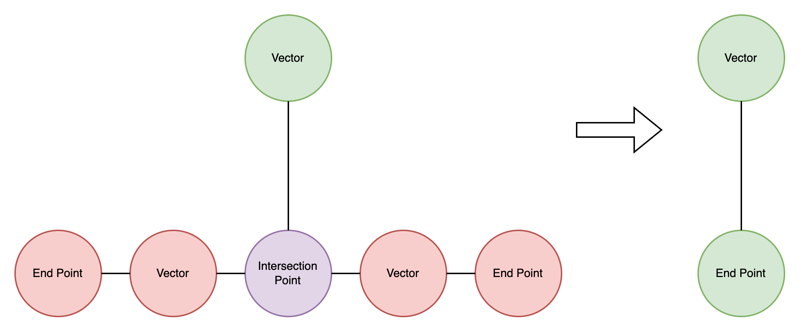
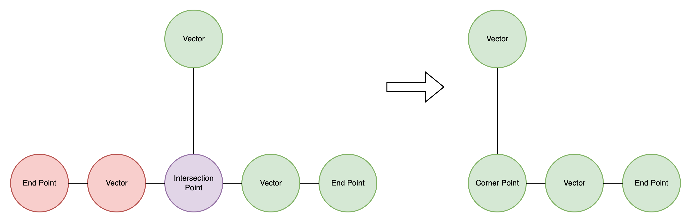

# Graph-Based Contour Analysis Through Multi-dimensional Feature Extraction

## 3. Contour Analysis Function

### 3.1 Introduction and Problem Statement

The contour analysis function performs comprehensive structural analysis of skeletal graph representations to extract meaningful geometric, topological, and semantic features. This component transforms the raw graph structures produced by skeletonization into rich feature sets that enable pattern recognition and concept matching in subsequent processing stages.

The system addresses the fundamental challenge of quantifying structural characteristics in graph-based image representations, extracting both low-level geometric properties and high-level topological relationships that capture the essential characteristics of contour structures.

### 3.2 Theoretical Foundation

#### 3.2.1 Детектування

Детектор оброблює результат роботи алгоритму бінарізації та склетизації. Ми отримуємо список точок стурутури, які ми потім оброблюємо та перетворюємо в граф. Обробка заключається в створені проміжного класу - відрізок (в системі це клас `Vector`). 

Точки можуть бути декількох типів:

- `Point` - звичайна точнка, місце зʼєднання відрізків.
- `EndPoint` - термінальна точка структури. Після цієї точки розвитку структури немає.
- `CornerPoint` - кутова точка. Точка зʼєднання відрізків при якому ми маємо зміну звичайного напрямку розвитку структури.
- `IntersectionPoint` - точка зʼєднання відрізків при якому ми маємо зʼєднання більше ніж двох відрізків.

Редукція точок:

1. Редукція точки перетину (`IntersectionPoint`) до кінцевої точки (`EndPoint`):



*Якщо після структурної редукції кількість відрізків (`Vector`) для заданої точки дорівнює 1, то точка перетину спрощується до кінцевої точки (`EndPoint`).*

2. Редукція точки перетину (`IntersectionPoint`) до точки кута (`CornerPoint`):



*Якщо після структурної редукції кількість відрізків (`Vector`) для заданої точки не відповідає визначеній кількості для точки перетину (`IntersectionPoint`), то точка перетину спрощується до кутової точки (`CornerPoint`).*

3. Редукція кутової точки (`CornerPoint`) до кінцевої точки (`EndPoint`) робиться за тими ж правилами, що і для точки перетину (`IntersectionPoint`).

Відрізки (`Vector`) можуть бути двох підтипів:

- `HorizontalVector` - відрізок, який має більшу горизонтальну проекцію ніж вертикальну.
- `VerticalVector` - відрізок, який має більшу вертикальну проекцію ніж горизонтальну.


#### 3.2.2 Graph Optimization

The analysis begins with graph preprocessing that consolidates redundant structural elements. The system implements intersection point merging based on spatial proximity criteria:

```math
\text{merge}(p_1, p_2) = \begin{cases}
\text{true}, & \text{if } d(p_1, p_2) \leq \theta \text{ and } \text{deg}(p_1) > 2 \text{ and } \text{deg}(p_2) > 2 \\
\text{false}, & \text{otherwise}
\end{cases}
```

where d(p₁, p₂) represents Euclidean distance between intersection points and θ is the configurable merge threshold. Merged points are positioned at the centroid of the original intersection locations, preserving connectivity while reducing structural redundancy.

#### 3.2.2 Multi-Analyzer Framework

The analysis employs a modular analyzer framework that applies specialized algorithms for different structural characteristics:

**Contour Type Analysis**: Determines topological classification by examining node degree distribution:

```math
\text{ContourType} = \begin{cases}
\text{CLOSED}, & \text{if } \forall n \in V, \text{deg}(n) = 2 \\
\text{OPEN}, & \text{otherwise}
\end{cases}
```

**Monotony Analysis**: Evaluates directional consistency by analyzing vector direction diversity across graph edges. The system extracts directional vectors for all edges and classifies contour development based on directional uniformity.

**Cycle Analysis**: Employs NetworkX cycle detection algorithms [1] to identify and count elementary cycles within the graph structure, providing measures of structural complexity and closure patterns.

#### 3.2.3 Tertiary Feature Extraction

The tertiary feature extraction framework implements the Strategy pattern [2] to systematically extract higher-level structural characteristics:

- **Vector Count Strategy**: Quantifies structural complexity through edge enumeration
- **Critical Point Strategies**: Count and classify intersection points, endpoints, and corner points
- **Quadrant Change Strategy**: Analyzes spatial distribution patterns and directional transitions

### 3.3 Analysis Architecture

The contour analysis architecture implements a pipeline approach that combines graph preprocessing, multi-dimensional analysis, and feature persistence through Neo4j graph database integration.

#### 3.3.1 Processing Pipeline

The analysis pipeline consists of five sequential stages:

1. **Graph Deserialization**: Conversion from JSON format to NetworkX graph representation
2. **Preprocessing**: Intersection point merging and structural optimization
3. **Graph Persistence**: Storage of processed graph structure in Neo4j database
4. **Multi-Analyzer Processing**: Application of specialized analysis algorithms
5. **Tertiary Feature Extraction**: Systematic extraction of high-level structural features

#### 3.3.2 Analyzer Framework

The system employs an extensible analyzer framework based on the Strategy pattern, enabling dynamic addition of analysis capabilities. Each analyzer implements standardized interfaces for analysis execution and result persistence, ensuring consistent processing patterns across different feature types.

The framework supports both quantitative metrics (cycle counts, node counts) and qualitative classifications (contour type, monotony characteristics), providing comprehensive characterization of structural properties.

### 3.4 Performance Characteristics and Integration

The contour analysis function demonstrates efficient processing characteristics through optimized graph algorithms and selective feature extraction. The modular architecture enables parallel execution of independent analyzers while maintaining data consistency through transactional database operations.

**Database Integration**: The system employs Neo4j graph database [3] for persistent storage of analysis results, enabling complex queries and relationship analysis across multiple image sessions. Feature persistence employs transactional operations to ensure data consistency.

**Microservice Architecture**: Integration with the NaturalAGI pipeline occurs through Kafka-based messaging, providing asynchronous processing capabilities and fault tolerance through dead letter queue mechanisms.

### 3.5 Output and Compatibility

The contour analysis function produces comprehensive feature sets stored as graph node properties in Neo4j database. Output features include both structural metrics (vector counts, cycle counts, critical point classifications) and semantic properties (contour type, monotony characteristics).

The enriched graph representations serve as input for subsequent classification and concept matching processes, providing the detailed structural characterization required for pattern recognition algorithms.

### 3.6 Conclusion

The contour analysis function provides comprehensive structural characterization of skeletal graph representations through multi-dimensional feature extraction and analysis. The modular architecture ensures extensibility while maintaining computational efficiency, enabling detailed structural analysis suitable for pattern recognition and concept matching applications.

The integration of preprocessing optimization, multi-analyzer frameworks, and tertiary feature extraction creates a robust foundation for subsequent stages of the NaturalAGI processing pipeline.

---

## References

[1] Hagberg, A., Swart, P., & Chult, D. S. (2008). Exploring network structure, dynamics, and function using NetworkX. Los Alamos National Lab.(LANL), Los Alamos, NM (United States).

[2] Gamma, E., Helm, R., Johnson, R., & Vlissides, J. (1995). Design patterns: elements of reusable object-oriented software. Addison-Wesley.

[3] Robinson, I., Webber, J., & Eifrem, E. (2015). Graph databases: new opportunities for connected data. O'Reilly Media.
